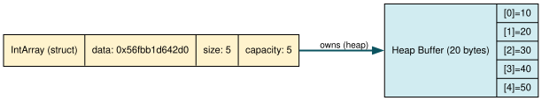

+++
title = "Hello, Array: malloc, free and Manual Bookkeeping"
author = ["pablo"]
date = 2026-05-24
draft = false
translationKey = "post-01-hello-array"
series = ["Dynamic Arrays in C"]
seriesPost = 1
tags = ["c", "dynamic-array", "malloc", "data-structures", "pointers"]
description = "Implement a dynamic array in C with malloc, free, and manual bookkeeping. The foundation for understanding how every vector works under the hood."
slug = "dynamic-array-c-malloc-free"
+++

_Post 1 of the Dynamic Arrays in C series · [Full source code](https://github.com/ansuzgs/dynamic-arrays-c/blob/main/src/post_01.c)_

## The Problem No One Starts With
 
You have five integers. You put them in an array:
 
```c
int numbers[5] = {10, 20, 30, 40, 50};
```
 
Done. C gives you a contiguous chunk of 20 bytes on the stack, indexed from 0 to 4, and life is good.
 
Now your user wants to add a sixth integer. What do you do?
 
You can't resize a stack array. Its size was baked into the binary at compile time, the compiler saw `5`, calculated 20 bytes, and that's the space your function's stack frame has. There's no negotiation. You could declare `int numbers[1000]` and hope it's big enough, but hope is not a memory management strategy.
 
You could use a variable-length array (`int numbers[n]`), but that just shifts the problem: `n` is still fixed once you enter the function. Worse, VLAs live on the stack, which is limited to a few megabytes. Store a million integers and you blow the stack with no graceful recovery.
 
The real solution lives on the heap. `malloc` lets you ask the operating system for a chunk of memory at runtime, any size you want, limited only by available RAM. But malloc gives you raw bytes and a pointer. No size tracking. No bounds checking. No "how full am I?" bookkeeping. You get the memory and the responsibility.
 
This is where every dynamic array begins: not with a clever data structure, but with a basic question of *bookkeeping*. Who tracks how many elements you've stored? Who tracks how many you *could* store? Who makes sure the memory gets freed when you're done?
 
In C, the answer is always the same: you do.
 
This post builds the simplest possible dynamic array, one that holds integers, has a fixed capacity, and does exactly three things: create, push, and destroy. No automatic growth (that's [Post 2](../post-02-growing-pain/index.md)), no generics (Post 4), no error recovery (Post 6). Just the raw skeleton that everything else builds on.
 
By the end, you'll understand two things most C tutorials skip: why the metadata struct exists, and why the order in which you call `free` matters.
 
Let's allocate some memory.
 
 
## The Struct: What an Array Knows About Itself
 
A raw `malloc` call returns `void *`, a pointer to bytes with no meaning attached. If you allocate space for 10 integers, nobody remembers that number except you. The instant you lose track of the capacity, you're writing bugs.
 
So the first thing a dynamic array needs isn't data. It's *metadata*: a small struct that sits alongside the data and remembers the bookkeeping details.
 
```c
typedef struct {
    int    *data;       /* Pointer to the heap buffer holding elements  */
    size_t  size;       /* How many elements have been stored           */
    size_t  capacity;   /* How many elements the buffer can hold        */
} IntArray;
```
 
Three fields. This is the minimum viable bookkeeping:
 
`data` is a pointer to the actual heap allocation where elements live. It's the result of a `malloc(capacity * sizeof(int))` call. When you access `arr->data[3]`, you're reading the fourth integer in that allocation.
 
`size` tracks how many elements the user has actually pushed. It starts at 0 and increments with every `array_push`. It is *not* the same as capacity, this distinction is the single most important concept in dynamic array design.
 
`capacity` tracks how many elements the allocation *can hold*. If you malloced space for 10 integers, capacity is 10, even if size is only 3. The gap between size and capacity is wasted memory, we allocated it but aren't using it yet. Managing that gap is the art of dynamic arrays.
 
Think of it like a parking garage. `capacity` is the number of parking spots. `size` is the number of cars currently parked. The garage exists at a specific address (`data`). You can have an empty garage (size=0, capacity=100) or a full one (size=100, capacity=100), but you can never park more cars than spots, unless you build a bigger garage.
 
<!-- IMAGE: outputs/post_01_state.svg — Graphviz diagram showing IntArray struct (data, size, capacity) pointing to the heap buffer with 5 slots ([0]=10, [1]=20, [2]=30, [3]=40, [4]=50). Place this image here, full width, centered. Alt text: "Diagram showing the IntArray metadata struct with a pointer to a contiguous heap buffer of 5 integer slots." -->
 
*Diagram showing the IntArray metadata struct with a pointer to a contiguous heap buffer of 5 integer slots.*
 
## What malloc Actually Does
 
Before looking at the implementation, it's worth understanding what happens when you call `malloc(20)`.
 
You're not asking the OS for exactly 20 bytes. The C runtime's allocator (glibc's `ptmalloc2` on Linux, `jemalloc` on FreeBSD, etc.) maintains pools of pre-allocated memory called *arenas*. When you call `malloc(20)`, the allocator finds a free block in one of its pools, marks it as used, and returns its address. If no pool has room, the allocator requests more memory from the kernel via `sbrk` or `mmap`, but this is the expensive path, and it happens rarely.
 
The returned pointer has a hidden *header* just before it (typically 8–16 bytes) where the allocator stores metadata: the block's size, whether it's in use, and pointers to adjacent free blocks. This is how `free` knows how many bytes to release, you never tell it the size, because the allocator already recorded it.
 
<pre style="width: fit-content; margin: 0 auto;">
What malloc returns:        What actually exists in memory:
                            ┌──────────────────┐
                            │ allocator header │  (hidden, 8-16 bytes)
    ptr ──────────────────► ├──────────────────┤
                            │                  │
                            │   your 20 bytes  │
                            │                  │
                            └──────────────────┘
</pre>
 
This has practical consequences. Every `malloc` call costs not just the bytes you asked for, but also the overhead of that header. If you allocate a million 4-byte blocks, you're actually using 12–20 bytes per block, the 4 bytes you wanted plus the hidden header. For our dynamic array, this is why we make *two* allocations (one for the struct, one for the buffer) instead of millions of individual `malloc(sizeof(int))` calls: fewer allocations means less overhead.
 
It also means that `free` doesn't need to know the size of the allocation, it reads the header. But `free` doesn't zero the memory or return it to the OS. The block is just marked as available in the allocator's free list. The bytes remain there, with their old values, until something else overwrites them. This is why use-after-free bugs are insidious: the data *looks* valid long after you've freed it.
 
 
## The Code
 
The implementation compiles with zero warnings under `gcc -Wall -Wextra -Wpedantic -std=c11` and runs without leaks.
 
> The full source, including a `main()` that demonstrates every operation step by step, is available [on GitHub](https://github.com/ansuzgs/dynamic-arrays-c/blob/main/src/post_01.c). Below are the essential pieces.
 
### Lifecycle: Create and Destroy
 
```c
IntArray *array_create(size_t capacity)
{
    if (capacity == 0) {
        fprintf(stderr, "array_create: capacity must be > 0\n");
        return NULL;
    }
 
    IntArray *arr = malloc(sizeof(IntArray));       /* allocation #1 */
    if (!arr) {
        fprintf(stderr, "array_create: failed to allocate struct\n");
        return NULL;
    }
 
    arr->data = malloc(capacity * sizeof(int));     /* allocation #2 */
    if (!arr->data) {
        fprintf(stderr, "array_create: failed to allocate buffer\n");
        free(arr);          /* Don't leak the struct if the buffer fails */
        return NULL;
    }
 
    arr->size     = 0;
    arr->capacity = capacity;
    return arr;
}
```
 
Notice the error handling between the two allocations. If the first `malloc` succeeds but the second fails, we have a partially-constructed object: a struct on the heap with an invalid `data` pointer. If we returned NULL without freeing the struct, those 24 bytes (three fields on a 64-bit system: one pointer + two `size_t`) would be leaked. The `free(arr)` call before the `return NULL` prevents that. This pattern, clean up everything you've allocated so far when a later step fails, is the foundation of resource cleanup in C. You'll see it scaled up in Post 6 when we discuss error handling strategies.
 
```c
void array_destroy(IntArray *arr)
{
    if (!arr) return;
    free(arr->data);    /* 1. free the element buffer                    */
    arr->data = NULL;   /*    (defensive: prevent use-after-free)        */
    free(arr);          /* 2. free the struct itself                     */
}
```
 
Two allocations in `array_create`, two frees in `array_destroy`. The symmetry is intentional and the order is not negotiable, more on that below.
 
### Operations: Push and Get
 
```c
int array_push(IntArray *arr, int value)
{
    if (!arr) {
        fprintf(stderr, "array_push: NULL array\n");
        return -1;
    }
    if (arr->size >= arr->capacity) {
        fprintf(stderr,
                "array_push: full (size=%zu, capacity=%zu). "
                "Cannot add %d.\n",
                arr->size, arr->capacity, value);
        return -1;
    }
 
    arr->data[arr->size] = value;
    arr->size++;
    return 0;
}
 
int array_get(const IntArray *arr, size_t index, int *out)
{
    if (!arr || index >= arr->size) return -1;
    *out = arr->data[index];
    return 0;
}
 
size_t array_size(const IntArray *arr)     { return arr ? arr->size     : 0; }
size_t array_capacity(const IntArray *arr) { return arr ? arr->capacity : 0; }
```
 
Push writes to `arr->data[arr->size]` and increments `size`. Two lines of actual logic; the rest is validation. The expression `arr->data[arr->size]` works because array indexing in C is pointer arithmetic: `arr->data[n]` is equivalent to `*(arr->data + n)`, which means "start at the address in `data`, move forward `n * sizeof(int)` bytes, and dereference." As long as `n < capacity`, that address is within our allocation.
 
`array_get` returns the value through an output pointer (`out`) instead of returning it directly. This is because we need two channels: the value itself and whether the operation succeeded. Returning `int` for both the value and the error code would be ambiguous, is `-1` an error or a legitimate stored value? The output pointer pattern separates these concerns cleanly.
 
### Driving It All
 
```c
int main(void)
{
    IntArray *arr = array_create(5);
    if (!arr) return 1;
 
    int values[] = {10, 20, 30, 40, 50};
    for (int i = 0; i < 5; i++)
        array_push(arr, values[i]);
 
    /* This will fail — array is full */
    int rc = array_push(arr, 60);  /* returns -1 */
 
    /* Read back */
    int val;
    for (size_t i = 0; i < array_size(arr); i++) {
        array_get(arr, i, &val);
        printf("arr[%zu] = %d\n", i, val);
    }
 
    array_destroy(arr);
    return 0;
}
```
 
Compile and run it yourself:
 
```bash
gcc -Wall -Wextra -Wpedantic -std=c11 -o post_01 post_01.c
./post_01
```
 
<!-- IMAGE: outputs/post_01_ascii.png — Screenshot of the ASCII visualization output showing the array after pushing 3 elements (10, 20, 30) into a capacity-5 array, with occupied slots and empty slots clearly distinguished. Place here to show what the program output looks like. Alt text: "ASCII box-drawing visualization showing 3 occupied slots and 2 empty slots in a capacity-5 array." -->

<pre style="width: fit-content; margin: 0 auto;">
╔══════════════════════════════════════════════════════╗
║  After push(30)                                      ║
╠══════════════════════════════════════════════════════╣
║  size = 3      capacity = 5      elem = 4 bytes      ║
║  data = 0x56fbb1d642d0  (heap)                       ║
╠══════════════════════════════════════════════════════╣
║  ┌──────┌──────┌──────┌──────┌──────┐                ║
║  │   10 │   20 │   30 │  ·   │  ·   │                ║
║  └──────└──────└──────└──────└──────┘                ║
║     0      1      2      3      4                    ║
║                   ▲ size=3                           ║
╠══════════════════════════════════════════════════════╣
║  12B used / 20B allocated = 60.0% utilization        ║
║  8B wasted (40.0%)                                   ║
╚══════════════════════════════════════════════════════╝
</pre>
*Screenshot of the ASCII visualization output showing the array after pushing 3 elements (10, 20, 30) into a capacity-5 array, with occupied slots and empty slots clearly distinguished.*
 
## Walking Through the Code
 
### Two Allocations, Two Frees
 
The most important pattern in this file is the symmetry between `array_create` and `array_destroy`.
 
`array_create` performs two allocations:
 
```
malloc(sizeof(IntArray))          →  the metadata struct   (24 bytes on 64-bit)
malloc(capacity * sizeof(int))    →  the element buffer    (capacity × 4 bytes)
```
 
`array_destroy` performs two frees, in reverse order:
 
```
free(arr->data)    →  element buffer first
free(arr)          →  metadata struct second
```
 
This reverse order is not a stylistic preference, it's a correctness requirement. Let's trace what happens if you swap them:
 
```c
/* WRONG — undefined behavior */
free(arr);           /* struct memory returned to allocator */
free(arr->data);     /* arr is now a dangling pointer — reading arr->data
                        is an invalid memory access */
```
 
After `free(arr)`, the memory at `arr` has been returned to the allocator. It could be reused by the very next `malloc` call, even one happening on another thread. Reading `arr->data` at that point might return the original pointer value (if the memory hasn't been touched yet), or it might return garbage (if the allocator has overwritten those bytes with its own bookkeeping data for the free list). Either way, it's undefined behavior. Valgrind would flag this as "Invalid read of size 8" (the size of a pointer).
 
The general principle: when you have nested allocations (a struct that owns pointers to other allocations), free from the inside out, innermost allocations first, outermost last.
 
### The Defensive NULL Assignment
 
After freeing the data buffer, we set `arr->data = NULL`:
 
```c
free(arr->data);
arr->data = NULL;    /* defensive */
free(arr);
```
 
In this simple code, nothing touches `arr->data` between the two frees, so the NULL assignment does nothing. But in more complex code, with error handlers, callbacks, or cleanup functions that might run between those two lines, the NULL acts as a safety net. If anything tries to dereference `arr->data` after the first free, it hits a NULL pointer dereference instead of a use-after-free. A NULL dereference is a loud, immediate crash with a clear stack trace. A use-after-free is a silent corruption that might not manifest until thousands of lines later. You trade one bug for a more debuggable bug.
 
This pattern is sometimes called *defensive clearing* or *poisoning*. Some codebases go further and zero the entire struct before the final free (`memset(arr, 0, sizeof(*arr))`), though that has a cost: the compiler might optimize it away if it can prove nothing reads the struct afterward (since reading freed memory is UB). Post 6 addresses this in the context of a broader error-handling strategy.
 
### Pointer Arithmetic Inside Push
 
The line that does the actual work in `array_push` is:
 
```c
arr->data[arr->size] = value;
```
 
This single line involves three dereferences:
 
1. `arr` is dereferenced to access the struct on the heap
2. `arr->data` is dereferenced to get the base address of the buffer
3. The result is indexed by `arr->size` to compute the write address
On a 64-bit system, the write address is calculated as:
 
```
write_address = arr->data + (arr->size * sizeof(int))
              = arr->data + (arr->size * 4)
```
 
The `size >= capacity` check before this line guarantees that `write_address` falls within our allocated buffer. Without it, we'd be writing past the end of our allocation, a heap buffer overflow. Depending on what lives past our allocation, this could corrupt the allocator's metadata (causing a crash in a later, unrelated `malloc` or `free`), overwrite another variable's data (causing impossible-looking bugs), or hit a guard page (causing an immediate segfault). AddressSanitizer (`gcc -fsanitize=address`) catches these instantly, and it's worth compiling with it during development.
 
 
## Key Concepts and Tradeoffs
 
### Stack vs Heap for the Metadata Struct
 
Our `array_create` allocates the `IntArray` struct on the heap:
 
```c
IntArray *arr = malloc(sizeof(IntArray));
```
 
Why not put it on the stack? You could write:
 
```c
IntArray array_create_stack(size_t capacity) {
    IntArray arr;
    arr.data = malloc(capacity * sizeof(int));
    arr.size = 0;
    arr.capacity = capacity;
    return arr;  /* returns a copy */
}
```
 
This works, and it's actually slightly faster, stack allocation is just a pointer decrement on the stack pointer register, while `malloc` navigates free lists. But it changes the API in subtle and dangerous ways.
 
The caller receives a *copy* of the struct. If they pass that copy to `array_push`, the function modifies its *own* copy of `size`, the caller's `size` remains unchanged. You'd need to pass by pointer everywhere: `array_push(&arr, value)`. That's workable, but easy to forget, and the compiler won't warn you.
 
More seriously, the stack struct's lifetime is tied to its scope. If you return it from a function, you're returning a copy (fine). If you store a pointer to it and the function returns, that pointer is dangling (catastrophic). Heap allocation gives you a stable pointer that survives function boundaries, can be stored in other data structures, and has a clear ownership model: whoever holds the pointer is responsible for calling `array_destroy`.
 
For a library API, heap allocation is the standard choice. You'll see this pattern in virtually every C library: `thing_create()` returns a pointer, `thing_destroy()` frees it. The tradeoff is explicit: you trade a few nanoseconds of `malloc` overhead and the burden of manual cleanup for an API that's unambiguous about ownership and lifetime.
 
### Memory Waste: The Capacity Problem
 
When you create an array with capacity 10 and store 3 elements, you're wasting 7 slots × 4 bytes = 28 bytes. That's a 70% waste ratio. For our post, where we push 5 elements into a capacity-5 array, waste drops to 0% by the end, but there's a window where we're paying for memory we haven't used yet.
 
Is this bad? It depends on scale. For a single array, 28 bytes is negligible. For a million small arrays in a memory-constrained embedded system, it might matter. For one large array, the waste percentage drops to near zero as you fill it.
 
The real question is: *what capacity should you start with?* If you pick too small (capacity=1), you'll need to reallocate on every push once we add growth in [Post 2](../post-02-growing-pain/index.md), each reallocation involves copying all existing elements. If you pick too large (capacity=10000), you waste memory on arrays that only hold 5 elements. The tension between *time* (fewer reallocations) and *space* (less waste) is the central tradeoff of dynamic arrays, and it leads directly to the growth factor analysis in Post 3.
 
### Why Return Codes, Not Assertions
 
`array_push` returns 0 on success and -1 on failure. It doesn't abort the program. This is a conscious design decision: the *caller* should decide what to do when a push fails. Maybe the caller wants to log and continue. Maybe they want to resize and retry. Maybe they want to exit. By returning an error code, we give the caller that choice.
 
The alternative, `assert(arr->size < arr->capacity)`, kills the program with no recovery. That's appropriate for programmer errors (invariants that should never be violated if the code is correct), but not for runtime conditions like "the array is full." A full array isn't a bug, it's a foreseeable state that the program should handle.
 
There's a subtlety here about `errno` and error reporting that's worth flagging. Our current approach, printing to stderr and returning -1, is fine for a learning exercise, but production code would typically set `errno` or return a richer error type. We'll discuss the full spectrum of error handling strategies in Post 6.
 
### Pointer Ownership: The Contract
 
There's an implicit contract in our API that no comment or type annotation enforces: the pointer returned by `array_create` is *owned* by the caller. Ownership means exactly one thing: the owner is responsible for calling `array_destroy` on it. Nobody else should free it. Nobody should free parts of it (`arr->data`) independently. And once `array_destroy` has been called, every copy of that pointer becomes invalid.
 
C has no language-level mechanism to enforce this. Rust has `Box<T>` and affine types. C++ has `std::unique_ptr`. In C, ownership is a convention, one you communicate through documentation, naming (`create`/`destroy` pairs), and discipline.
 
The bugs that arise from violating ownership are among the worst in C:
 
- **Double free**: two parts of the code both think they own the pointer and both call `array_destroy`. The second free corrupts the allocator's metadata.
- **Use after free**: one part of the code frees the pointer while another still holds a copy and keeps using it.
- **Memory leak**: nobody frees the pointer because everyone assumes someone else will.
In this simple post, ownership is obvious, `main` creates, `main` destroys. In larger programs with shared data structures, callbacks, and multithreading, ownership becomes the hardest problem in C. We'll revisit this in Post 7 when we add function pointers and destructors for element types.
 
 
## Try This and Watch It Fail
 
Before moving on, try these experiments with the code:
 
**Experiment 1: The Memory Leak.** In `array_destroy`, comment out `free(arr->data)`. Compile and run under valgrind (`valgrind --leak-check=full ./post_01`). You'll see "definitely lost: 20 bytes", that's the orphaned buffer. The struct was freed, but the buffer it pointed to was not. This is *exactly* the bug the knowledge test asks about.
 
**Experiment 2: Use After Free.** In `main`, add `printf("%d\n", arr->data[0]);` *after* `array_destroy(arr)`. Compile and run. It might print `10`. It might print garbage. It might crash. That's undefined behavior, the data is freed, but the memory hasn't necessarily been overwritten yet. Valgrind would flag this as "Invalid read of size 4."
 
**Experiment 3: Buffer Overflow.** Remove the `size >= capacity` check in `array_push`. Push 100 elements into a capacity-5 array. Compile with AddressSanitizer (`gcc -fsanitize=address`) and watch it detect the heap-buffer-overflow.
 
**Experiment 4: The Double Free.** In `main`, call `array_destroy(arr)` twice. On many systems the second call will crash with "double free or corruption." Some allocators detect this immediately; others corrupt silently and crash later. This is why our `array_destroy` accepts NULL gracefully, if you set `arr = NULL` after the first destroy, the second call becomes a no-op.
 
 
## Knowledge Test
 
> **What happens if you call `free(arr)` but forget to call `free(arr->data)` first?**
 
The struct is returned to the heap allocator, but the buffer it pointed to, the `capacity * sizeof(int)` bytes at `arr->data`, remains allocated. No pointer to it exists anymore (the struct that held the pointer is freed), so the memory is *leaked*. It will never be freed for the rest of the program's lifetime. On a long-running program, repeated leaks like this accumulate and eventually exhaust memory. Valgrind would report "definitely lost: N bytes in 1 blocks."
 
 
## What's Next
 
Our array works, but it has a crippling limitation: when it's full, push fails. The user has to guess the right capacity upfront, and if they guess wrong, they're stuck.
 
In **[Post 2](../post-02-growing-pain/index.md): "Growing Pains: realloc and Automatic Capacity Management"**, we remove this limitation. We'll introduce `realloc`, the call that says "give me more space, and copy my data to the new location if needed." You'll learn why old pointers become invalid after a realloc, why the growth factor matters (spoiler: it determines your amortized cost), and why you must *never* write `arr->data = realloc(arr->data, new_size)` directly.
 
The fixed-capacity array you built today is the foundation. Everything from here builds on it.
 
 
*[Full source code](https://github.com/ansuzgs/dynamic-arrays-c/blob/main/src/post_01.c)*
<!-- · Compile: `gcc -Wall -Wextra -Wpedantic -std=c11 -o post_01 post_01.c` · Next post: [Growing Pains: realloc and Automatic Capacity Management](../post-02-growing-pain/index.md)* -->

