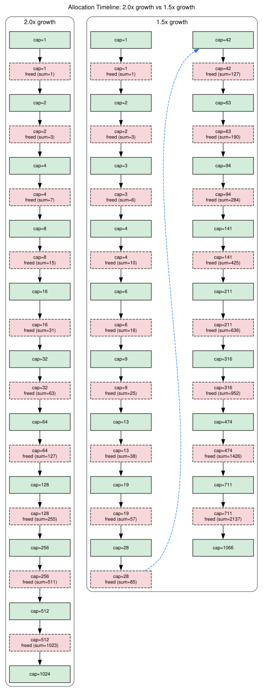

+++
title = "The Growth Factor Debate: 1.5x, 2x, or Something Else?"
author = ["pablo"]
date = 2026-06-01
draft = false
translationKey = "post-03-growth-factor"
series = ["Dynamic Arrays in C"]
seriesPost = 3
+++

*Post 3 of the Dynamic Arrays in C series · [Full source code on GitHub](https://github.com/ansuzgs/dynamic-arrays-c/blob/main/src/post_03.c)*


## The Choice We Skipped

In [Post 2](../post-02-growing-pain/index.md), we solved the "array is full" problem by doubling the capacity on every realloc. We wrote `new_cap = old_cap * 2`, watched the buffer grow from 2 to 4 to 8 to 16, and moved on. Three reallocations for 12 elementsm, pretty good. But we never justified the number 2. Why not 1.5? Why not 3? Why not just add 100 slots every time?

The answer matters more than you'd expect. The growth factor isn't just a magic constant you pick once and forget, it controls three properties that directly affect your program's behavior at scale: how many times you pay the expensive O(n) reallocation cost, how much memory you waste at any given moment, and whether the memory allocator can ever recycle your previously freed buffers.

That last property, memory reuse, is the insight most dynamic array tutorials skip entirely. It turns out that with a growth factor of 2x, the sum of all previously freed blocks is *always* less than the next allocation you need. The allocator can never combine them into a block big enough to satisfy your next realloc. With 1.5x, it can. That single mathematical fact is why Firefox, MSVC's `std::vector`, and Facebook's `folly::fbvector` all chose factors below 2.

But the story isn't one-sided. 2x growth has a real advantage: fewer reallocations. Doubling means you hit the realloc wall roughly log₂(N) times to reach N elements. With 1.5x, it's about log₁.₅(N), roughly 70% more reallocations. Each reallocation is an O(n) copy, so "more reallocations" means "more total bytes moved." Whether that matters depends on whether your bottleneck is memory or CPU.

There's a third option, too: additive growth. Instead of multiplying the capacity, you add a fixed number of slots each time, say, 100. This keeps memory waste bounded and predictable. The cost? You lose the amortized O(1) push guarantee. Total copy work becomes O(n²) instead of O(n), and for large arrays the difference is brutal.

This post puts numbers on all three strategies. We'll calculate amortized costs, trace the freed-memory arithmetic step by step, and run a benchmark harness to measure wall-clock differences. By the end, you'll be able to answer the question every systems programmer eventually faces: "what growth factor should I use, and why?"

The code builds directly on [Post 2](../post-02-growing-pain/index.md)'s auto-growing array. The struct gains two new fields, `growth_factor` (so each array instance can grow at its own rate) and `total_bytes_copied` (so we can measure the cumulative cost of all reallocations). The push function uses `growth_factor` instead of hardcoded `* 2`. Everything else is the same create-push-destroy lifecycle you already know.

Let's start with the math, because the math is what makes this debate interesting.


## Amortized Analysis: Why Geometric Growth Is O(1)

The word "amortized" confuses people, but the idea is simple: spread the cost of expensive operations across the cheap ones that follow. A single push into a full array costs O(n), you copy every existing element to the new buffer. But that expensive push bought you enough room for many cheap pushes (just assign a value, increment size, done). If you average the total work over all N pushes, the cost per push is constant.

Here's the concrete arithmetic for 2x growth starting from capacity 1. Each time the buffer fills, we double and copy everything:

```
Push  1: buffer full (cap=1), grow to 2, copy 1 element
Push  2: buffer full (cap=2), grow to 4, copy 2 elements
Push  4: buffer full (cap=4), grow to 8, copy 4 elements
Push  8: buffer full (cap=8), grow to 16, copy 8 elements
Push 16: ...
```

Total elements copied after reaching size N: 1 + 2 + 4 + ... + N/2 = N - 1. That's the geometric series. So for N pushes, the total copy work is about N elements, or O(1) amortized per push.

The same argument works for any growth factor g > 1. The total copy work is C + C·g + C·g² + ... ≈ C·g^(k+1)/(g-1), and the number of pushes is roughly C·g^k. Dividing gives an amortized cost of g/(g-1) per push. For g=2 that's 2 copies per push amortized. For g=1.5 it's 3. Both are O(1). The constant is larger for smaller growth factors, but it's still constant.

With additive growth (adding K slots each time), the math breaks. You realloc after K pushes, then after another K, then another K. Total copies: K + 2K + 3K + ... + N = K·(N/K)·(N/K+1)/2 ≈ N²/(2K). That's O(n²) total, or O(n) per push. Not constant. Not even close.

The code verifies this. After 1000 pushes starting from capacity 1:

<pre style="width: fit-content; margin: 0 auto;">
╔═══════════════════════════════════════════════════════════════╗
║  AMORTIZED COST ANALYSIS: 1000 pushes, start capacity = 1     ║
╠═══════════════╦═════════════════╦═════════════════════════════╣
║  Strategy     ║ Total copies    ║ Amortized cost/push         ║
╠═══════════════╬═════════════════╬═════════════════════════════╣
║  2.0x         ║            1023 ║ 1.0230 elements/push        ║
║  1.5x         ║            2137 ║ 2.1370 elements/push        ║
║  Additive +10 ║           49600 ║ 49.6000 elements/push       ║
║  Additive+100 ║            4510 ║ 4.5100 elements/push        ║
╚═══════════════╩═════════════════╩═════════════════════════════╝
</pre>

2x copies about 1 element per push (amortized). 1.5x copies about 2. Both constant. Additive +10 copies about 50, and that number grows linearly with N. At 10,000 pushes, the additive cost will be around 500 per push. At a million, 50,000.


## The Memory Reuse Argument

Here's the insight that separates this post from every "just pick 2x" tutorial.

When you realloc from capacity C to capacity C·g, the old block of C slots is freed. If the allocator places your new block somewhere else in the heap (which it usually does for large reallocations), the old block becomes a hole, freed memory sitting there, waiting to be reused. As you keep growing, you accumulate more holes: the blocks from every previous reallocation.

The question is: can the allocator ever combine those holes into a single block large enough for your *next* allocation?

With 2x growth starting from capacity 1, the freed blocks are 1, 2, 4, 8, 16, ... After freeing the block of size 2^(k-1), the sum of all freed blocks is 1 + 2 + 4 + ... + 2^(k-1) = 2^k - 1. But the next allocation needs exactly 2^k slots. The sum of freed memory is always *one slot short*. The allocator can never reuse it.

<pre style="width: fit-content; margin: 0 auto;">
┌─────────────────────────────────────────────────────────────┐
│  MEMORY REUSE ANALYSIS: factor = 2.00x, start = 1           │
├───────┬──────────┬──────────┬──────────────┬────────────────┤
│ Step  │ Capacity │ Freed    │ Sum of freed │ Reuse?         │
├───────┼──────────┼──────────┼──────────────┼────────────────┤
│     1 │     1→2  │        1 │            1 │ no             │
│     2 │     2→4  │        2 │            3 │ no             │
│     3 │     4→8  │        4 │            7 │ no             │
│     4 │     8→16 │        8 │           15 │ no             │
│     5 │    16→32 │       16 │           31 │ no             │
│   ... │   ...    │      ... │          ... │ no (never)     │
└───────┴──────────┴──────────┴──────────────┴────────────────┘
  ⚠ Freed memory NEVER exceeds the next allocation.
</pre>

The pattern is the same at every step: sum of freed = 2^k - 1, next allocation = 2^k. Always one short.

With 1.5x growth, the arithmetic works out differently. The freed blocks grow more slowly, and after just a few reallocations, their cumulative sum overtakes the next allocation size:

<pre style="width: fit-content; margin: 0 auto;">
┌─────────────────────────────────────────────────────────────┐
│  MEMORY REUSE ANALYSIS: factor = 1.50x, start = 1           │
├───────┬──────────┬──────────┬──────────────┬────────────────┤
│ Step  │ Capacity │ Freed    │ Sum of freed │ Reuse?         │
├───────┼──────────┼──────────┼──────────────┼────────────────┤
│     1 │     1→2  │        1 │            1 │ no             │
│     2 │     2→3  │        2 │            3 │ YES, first!    │
│     3 │     3→4  │        3 │            6 │ yes            │
│     4 │     4→6  │        4 │           10 │ yes            │
│     5 │     6→9  │        6 │           16 │ yes            │
│     6 │     9→13 │        9 │           25 │ yes            │
│   ... │   ...    │      ... │          ... │ yes (always)   │
└───────┴──────────┴──────────┴──────────────┴────────────────┘
  ✓ Freed memory can be coalesced and reused by the allocator.
</pre>

By step 2, the cumulative freed memory (3 slots) already equals the next allocation (3 slots). From that point on, the allocator *could* combine the previously freed blocks into one contiguous region and hand it back for the next realloc. Whether it *will* depends on the allocator implementation and heap fragmentation, but 2x growth never even gives it the chance.

<!-- IMAGE: outputs/post_03_timeline.svg — Graphviz diagram showing the allocation timeline of 2.0x vs 1.5x side by side. Each box represents an allocation event: green/solid for live blocks, red/dashed for freed blocks. The freed blocks show their cumulative sum, letting the reader visually compare when reuse becomes possible. Full width. Alt text: "Allocation timeline comparing 2.0x and 1.5x growth. The 2.0x column shows freed block sums always falling short of the next allocation. The 1.5x column shows freed sums exceeding the next allocation after just a few steps." -->

*Diagram showing the allocation timeline of 2.0x vs 1.5x side by side. Each box represents an allocation event: green/solid for live blocks, red/dashed for freed blocks. The freed blocks show their cumulative sum, letting the reader visually compare when reuse becomes possible.*

The general rule: for any growth factor g, memory reuse is possible when g ≤ φ (the golden ratio, ≈ 1.618). At g = φ, the sum of freed blocks equals the next allocation exactly. Below φ, you have a surplus. Above φ, you have a deficit. The factor 2.0 is above φ, so it can never reuse. The factor 1.5 is below, so it always can (after the first few rounds).

This is why Facebook's `folly::fbvector` uses 1.5. In their words: "memory that is freed early can be reused for later allocations."


## The Side-by-Side Comparison

The code runs 1000 pushes starting from capacity 1 with three strategies and tracks everything:

<pre style="width: fit-content; margin: 0 auto;">
╔══════════════════════════════════════════════════════════════════════════════╗
║  GROWTH STRATEGY COMPARISON: 1000 pushes, initial capacity = 1               ║
╠═══════════════╦══════════╦══════════╦════════════╦══════════╦════════════════╣
║  Strategy     ║ Final    ║ Reallocs ║ Bytes      ║ Peak     ║ Memory         ║
║               ║ Capacity ║          ║ Copied     ║ Waste    ║ Reuse?         ║
╠═══════════════╬══════════╬══════════╬════════════╬══════════╬════════════════╣
║  2.0x         ║     1024 ║       10 ║       4092 ║  2044B   ║ No             ║
║  1.5x         ║     1066 ║       17 ║       8548 ║  1416B   ║ Yes (after ~4) ║
║  Additive +10 ║     1001 ║      100 ║     198400 ║    36B   ║ Yes (after ~4) ║
╚═══════════════╩══════════╩══════════╩════════════╩══════════╩════════════════╝
</pre>

Read each column as a tradeoff axis. 2x wins on reallocations (10 vs 17) and bytes copied (4,092 vs 8,548), but loses on peak waste (2,044 bytes vs 1,416) and loses badly on memory reuse (never possible). Additive +10 has almost zero waste (36 bytes peak) but 100 reallocations and 198,400 bytes copied, 48x more copy work than 2x.

There is no universally best row. Each strategy optimizes for a different concern.


## The Benchmark

Numbers on paper are one thing. Wall-clock time is another. The code includes a simple benchmark harness that pushes 100,000 elements under each strategy and measures the median time across 5 iterations:

<pre style="width: fit-content; margin: 0 auto;">
╔════════════════════════════════════════════════════════════════╗
║  BENCHMARK: 100000 pushes, 5 iterations, start capacity = 1    ║
╠════════════════╦══════════╦════════════╦═══════════════════════╣
║  Strategy      ║ Reallocs ║ Final Cap  ║ Median Time (ms)      ║
╠════════════════╬══════════╬════════════╬═══════════════════════╣
║  2.0x          ║       17 ║     131072 ║      0.314            ║
║  1.5x          ║       29 ║     138255 ║      0.306            ║
║  1.25x         ║       51 ║     120501 ║      0.303            ║
║  Additive +10  ║    10000 ║     100001 ║      0.501            ║
║  Additive +100 ║     1000 ║     100001 ║      0.423            ║
╚════════════════╩══════════╩════════════╩═══════════════════════╝
</pre>

The geometric strategies (2.0x, 1.5x, 1.25x) are all in the same ballpark, sub-millisecond for 100,000 pushes. The differences between them are dominated by noise at this scale. The additive strategies are measurably slower: +10 is about 60% slower than 2x, and +100 is about 35% slower.

A caveat: this is a *simple* benchmark for illustration. We're not doing warm-up runs, not filtering outliers, not controlling for cache state or system load. Post 12 builds a proper benchmark framework. Don't use these numbers to choose a growth factor for production, use the *analysis* from the sections above, and verify with proper measurements in your actual workload.


## The Code

Here is the complete implementation. It compiles with zero warnings under `gcc -Wall -Wextra -Wpedantic -std=c11`, runs without leaks, and generates all the output shown above.

> The full file, including the benchmark harness, allocation history tracking, and Graphviz generator, is available [on GitHub](https://github.com/ansuzgs/dynamic-arrays-c/blob/main/src/post_03.c). Below are the essential pieces.

### The Struct: Now With Configurable Growth

```c
typedef struct {
    int    *data;               /* Heap buffer holding the elements          */
    size_t  size;               /* Elements currently stored                 */
    size_t  capacity;           /* Slots allocated                           */
    size_t  realloc_count;      /* How many reallocations have occurred      */
    size_t  total_bytes_copied; /* Cumulative bytes moved by realloc/memcpy  */
    double  growth_factor;      /* Multiplicative factor (e.g. 1.5, 2.0)    */
} IntArray;
```

Two new fields compared to [Post 2](../post-02-growing-pain/index.md). `growth_factor` lets each instance grow at a different rate, so we can run side-by-side comparisons. `total_bytes_copied` accumulates the cumulative cost of all reallocations, this is how we measure amortized cost empirically rather than just calculating it on paper.

### Push With Configurable Growth

```c
int array_push(IntArray *arr, int value, AllocHistory *history)
{
    if (!arr) return -1;

    if (arr->size >= arr->capacity) {
        size_t old_cap = arr->capacity;
        size_t new_cap = (size_t)(old_cap * arr->growth_factor);

        /* Guard against stalling: if truncation produces the same capacity,
         * bump by at least 1. This matters for small capacities with
         * growth factors close to 1.0. */
        if (new_cap <= old_cap) new_cap = old_cap + 1;

        int *tmp = realloc(arr->data, new_cap * sizeof(int));
        if (!tmp) return -1;

        arr->total_bytes_copied += arr->size * sizeof(int);
        arr->data     = tmp;
        arr->capacity = new_cap;
        arr->realloc_count++;
    }

    arr->data[arr->size] = value;
    arr->size++;
    return 0;
}
```

The temporary pointer pattern from [Post 2](../post-02-growing-pain/index.md) is unchanged, that part is non-negotiable regardless of growth strategy. The new piece is `(size_t)(old_cap * arr->growth_factor)` with the stall guard. Integer truncation matters: for capacity 3 with factor 1.25, the multiplication gives 3.75, which truncates to 3. Without the guard, the array would try to "grow" to its current capacity and loop forever. The `if (new_cap <= old_cap) new_cap = old_cap + 1` line catches this.

We also accumulate `arr->size * sizeof(int)` into `total_bytes_copied` on every realloc. This counts the bytes that realloc needs to copy from the old buffer to the new one. It's the real cost of growth, and the number that makes the amortized analysis concrete instead of theoretical.

### Additive Growth (The Control Group)

```c
int array_push_additive(IntArray *arr, int value, size_t increment,
                        AllocHistory *history)
{
    if (!arr) return -1;

    if (arr->size >= arr->capacity) {
        size_t new_cap = arr->capacity + increment;

        int *tmp = realloc(arr->data, new_cap * sizeof(int));
        if (!tmp) return -1;

        arr->total_bytes_copied += arr->size * sizeof(int);
        arr->data     = tmp;
        arr->capacity = new_cap;
        arr->realloc_count++;
    }

    arr->data[arr->size] = value;
    arr->size++;
    return 0;
}
```

Identical structure, different growth calculation: `new_cap = old_cap + increment` instead of `old_cap * factor`. The rest of the function, temporary pointer, bytes-copied tracking, increment-then-assign, is the same. That's the point: the *strategy* changes, the *mechanics* don't.

### Memory Reuse Analysis

```c
static void analyze_memory_reuse(double factor, size_t start_cap,
                                 size_t max_steps)
{
    size_t cap       = start_cap;
    size_t sum_freed = 0;

    for (size_t step = 0; step < max_steps; step++) {
        size_t old_cap = cap;
        size_t new_cap = (size_t)(cap * factor);
        if (new_cap <= cap) new_cap = cap + 1;

        sum_freed += old_cap;

        /* Can the allocator reuse the freed blocks? */
        int can_reuse = (sum_freed >= new_cap);

        /* ... print the row ... */

        cap = new_cap;
    }
}
```

This is the function that generates the "Sum of freed" tables shown earlier. It simulates the growth sequence without allocating any real memory, just integer arithmetic. At each step, it adds the old capacity to the running sum (that block was freed) and checks whether the sum meets or exceeds the new capacity (the block we need). The 2x column never reaches "yes." The 1.5x column reaches it on step 2 and stays there.


## Key Concepts and Tradeoffs

### Factor < φ ≈ 1.618: Memory Reuse Is Possible

The mathematical proof is elegant. For a growth factor g, the sum of the geometric series of freed blocks after k reallocations is S(k) = C · (g^k - 1) / (g - 1). The next allocation needs C · g^k. Reuse is possible when S(k) ≥ C · g^k, which simplifies to g^k - 1 ≥ (g - 1) · g^k, and further to 1 ≤ g^k · (2 - g). For this to hold for large k, we need 2 - g > 0, i.e., g < 2. More precisely, the crossover happens when g ≤ (1 + √5)/2 ≈ 1.618, the golden ratio. Factors at or below φ can reuse memory; factors above cannot.

### More Reallocations vs Less Waste: The Fundamental Tension

Every growth factor sits on a curve with two axes: reallocation count (how many expensive O(n) copies you pay) and peak waste (how much allocated-but-unused memory you carry). Higher factors mean fewer reallocations but more waste. Lower factors mean less waste but more reallocations. There is no point on this curve that minimizes both.

For 1000 pushes from capacity 1, the numbers are: 2.0x does 10 reallocations with 2,044 bytes peak waste. 1.5x does 17 reallocations with 1,416 bytes peak waste. 1.25x does 30 reallocations with 808 bytes peak waste. The relationship is smooth, you can pick any point on the curve by choosing your factor.

### When Additive Growth Makes Sense

Additive growth (adding a fixed K slots) breaks the O(1) amortized guarantee, but it has one genuine advantage: bounded, predictable waste. With `+100`, you never waste more than 99 slots regardless of array size. If you're building an array that will hold exactly 1 million 64-byte structs, and you know it in advance, and you cannot afford 500 MB of temporary over-allocation, then additive growth (or better yet, a single `array_reserve(1000000)` call) is the right choice.

The rule of thumb: if you don't know the final size, use geometric growth. If you do, pre-allocate with reserve.

### What Real Implementations Choose

| Implementation              | Factor | Reason                                       |
|-----------------------------|--------|----------------------------------------------|
| C++ `std::vector` (libstdc++)| 2.0x   | Simplicity, bit-shift math, historical choice |
| C++ `std::vector` (MSVC)    | 1.5x   | Memory reuse, lower peak waste               |
| Facebook `folly::fbvector`  | 1.5x   | Explicit memory reuse reasoning in docs      |
| Rust `Vec`                  | 2.0x   | Simplicity, amortized cost emphasis           |
| Go `slice`                  | ~2.0x → ~1.25x | 2x for small slices, tapers off for large |
| Python `list`               | ~1.125x | Very conservative, optimized for memory      |

Notice that no major implementation uses additive growth. The amortized cost penalty is too severe. The real debate is between the 1.5x camp (memory-conscious) and the 2x camp (copy-count-conscious).


## Try This and See

**Experiment 1: Vary the Starting Capacity.** Change `INIT_CAP` from 1 to 1024 in the code. Run the comparison again. With a large starting capacity, the reallocation counts drop for all strategies, and the waste differences become proportionally smaller. Pre-allocation is the cheapest optimization, cheaper than any growth factor debate.

**Experiment 2: Push a Million Elements.** Change `N` to 1,000,000 and run the amortized cost analysis. The 2x and 1.5x costs stay constant (that's what O(1) amortized means). The additive +10 cost climbs to around 50,000 elements per push. Feel the quadratic pain.

**Experiment 3: The Golden Ratio Factor.** Change the growth factor to 1.618 and run the memory reuse analysis. You'll see the sum of freed blocks exactly matches the next allocation at each step. This is the mathematical boundary, the largest factor that still permits reuse.


## Knowledge Test

> **With growth factor 2x starting at capacity 1, after 20 pushes, how much memory is wasted? What about 1.5x?**

With 2x: the capacity sequence is 1 → 2 → 4 → 8 → 16 → 32. After 20 pushes, size is 20 and capacity is 32 (the first power of 2 that fits 20). Wasted: 32 - 20 = 12 slots = 48 bytes. That's 37.5% waste.

With 1.5x: the capacity sequence is 1 → 2 → 3 → 4 → 6 → 9 → 13 → 19 → 28. After 20 pushes, size is 20 and capacity is 28 (the first value in the 1.5x sequence that fits 20). Wasted: 28 - 20 = 8 slots = 32 bytes. That's 28.6% waste.

<pre style="width: fit-content; margin: 0 auto;">
╔═══════════════╦════════════╦══════════╦═════════════════════════╗
║  Factor       ║ Final Cap  ║ Wasted   ║ Waste %                 ║
╠═══════════════╬════════════╬══════════╬═════════════════════════╣
║  2.0x         ║         32 ║    12 el ║   37.5%                 ║
║  1.5x         ║         28 ║     8 el ║   28.6%                 ║
╚═══════════════╩════════════╩══════════╩═════════════════════════╝
</pre>

The 1.5x factor wastes 33% less memory than 2x. It also used more reallocations to get there (7 vs 5), but both numbers are small enough to be negligible.


## What's Next

We've spent three posts on an array that holds `int`. It works, it grows, and now we can justify exactly *how* it grows. But `int` is a limitation. What if you want to store `float`? Or a 48-byte struct? Do you write a separate array implementation for each type?

In **Post 4: "Type Erasure: Generic Arrays with void* and memcpy"**, we replace `int *data` with `void *data` and add an `element_size` field. The array won't know what it's storing, just how many bytes each element occupies. You'll learn the pointer arithmetic that makes this work (`(char *)data + index * element_size`), why `memcpy` replaces direct assignment, and the tradeoff you accept when you erase type information: flexibility in exchange for compile-time safety.

The growth factor you chose in this post carries forward unchanged. The mechanics of geometric growth don't care whether your elements are 4-byte integers or 64-byte structs, only the byte count changes.

*[Full source code on GitHub](https://github.com/ansuzgs/dynamic-arrays-c/blob/main/src/post_03.c)*
<!-- · Compile: `gcc -Wall -Wextra -Wpedantic -std=c11 -o post_03 post_03.c` · Previous: [Growing Pains: realloc and Automatic Capacity Management](02_growing_pains.md) · Next: [Type Erasure: Generic Arrays with void* and memcpy](04_type_erasure.md)* -->
