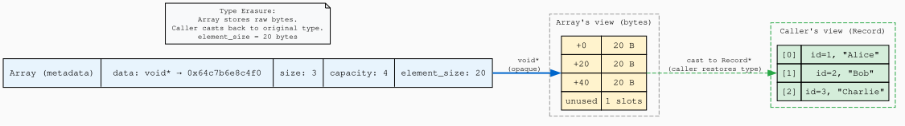

+++
title = "Type Erasure: Generic Arrays with void* and memcpy"
author = ["pablo"]
date = 2026-06-03
draft = false
translationKey = "post-04-type-erasure"
series = ["Dynamic Arrays in C"]
seriesPost = 4
tags = ["c", "dynamic-array", "void-pointer", "memcpy", "type-erasure", "generic-programming", "pointer-arithmetic", "data-structures"]
description = "Build a single dynamic array in C that stores any type — int, double, or struct — using void*, memcpy, and element_size pointer arithmetic."
slug = "type-erasure-generic-array-void-pointer-memcpy-c"
+++

*Post 4 of the Dynamic Arrays in C series · [Full source code on GitHub](https://github.com/ansuzgs/dynamic-arrays-c/blob/main/src/post_04.c)*


## The Limitation We've Been Ignoring

For three posts, our array has stored integers. Only integers. If you wanted to store floats, you'd write a `FloatArray`, same struct, same logic, same push function, just with `float` instead of `int` everywhere. If you wanted to store a 20-byte struct, you'd write a `StructArray`. And another for `double`. And another for `char*`. Every new type means a new copy of the same code with the same bugs, the same growth logic, the same visualization, the same tests, just with a different type name.

This is the copy-paste problem, and it's not academic. Real codebases suffer from it. The Linux kernel has separate implementations for different list types. Early C libraries shipped with type-specific containers. Every duplicate is a maintenance burden: fix a bug in one, forget to fix it in the others.

The question is: can we write one array implementation that stores *any* fixed-size type?

In C++, you'd use templates. In Java, generics. In Rust, monomorphization. C has none of these. What C has is `void*`, a pointer that can point to any type, and `memcpy`, a function that copies raw bytes without caring what those bytes represent. Together, they give you something called *type erasure*: the ability to strip away type information at the API boundary and work with raw memory instead.

The idea is simple. Instead of `int *data` (a pointer to integers), we use `void *data` (a pointer to... anything). Instead of `sizeof(int)` hardcoded in every allocation, we store `element_size`, a field that records how many bytes each element occupies. And instead of `arr->data[i] = value` (which requires the compiler to know the type), we use `memcpy` to copy `element_size` bytes from the caller's pointer into the array's buffer.

The result is a single `Array` struct that can hold integers, doubles, structs, pointers, or any other fixed-size type. The same `array_push` function works for all of them. The same `array_get` function works for all of them. The same growth logic, the same realloc pattern, the same ASCII visualization, all from one implementation.

But type erasure has a price. When you erase type information, the compiler can no longer check your work. If you create an `Array` with `element_size = sizeof(int)` and then accidentally push a `double` into it, memcpy will silently copy only 4 of the 8 bytes. The compiler won't warn you. The program won't crash, not immediately. It will just produce wrong results, and you'll spend hours debugging a corruption bug that a type-safe language would have caught at compile time.

This is the central tradeoff of this post: *flexibility vs safety*. One implementation for all types, but no compile-time guarantees that you're using it correctly. We'll live with this tradeoff for now and see exactly how it breaks in Demo 5. In Post 5, we'll add macro wrappers that restore type safety while keeping the generic implementation underneath.

The pointer arithmetic that makes this work is the concept you'll use most often in systems programming: `(char *)data + index * element_size`. If you understand this formula, why it uses `char*`, why it multiplies by `element_size`, and why `void*` arithmetic doesn't work, you understand the mechanical basis of every generic container in C.

Let's erase some types.


## The Struct: What Changed

The struct gains one field and changes one type:

```c
typedef struct {
    void   *data;           /* Opaque heap buffer, could hold anything      */
    size_t  size;           /* Number of elements currently stored          */
    size_t  capacity;       /* Number of element slots allocated            */
    size_t  element_size;   /* Size in bytes of each element                */
    size_t  realloc_count;  /* Diagnostic: how many times we've grown       */
} Array;
```

`int *data` is now `void *data`. The pointer no longer carries type information, it's just an address. The compiler doesn't know what lives at that address, and neither does the array. That's the "erasure" part.

`element_size` is the field that makes everything work. When you create an array, you tell it "each element is N bytes." From that point on, every operation, push, get, grow, visualize, uses `element_size` to compute offsets. It's the only piece of type information the array retains, and it's not a type at all, it's a number.

<!-- IMAGE: outputs/post_04_layout.svg, Graphviz diagram showing the Array metadata struct pointing to an opaque byte buffer (array's view) with arrows showing how the caller's cast restores typed interpretation. Place this image here, full width. Alt text: "Diagram showing the dual view of a generic array: the array sees uniform byte ranges, the caller sees typed elements after casting." -->

*Diagram showing the Array metadata struct pointing to an opaque byte buffer (array's view) with arrows showing how the caller's cast restores typed interpretation.*


## The Code

The full file compiles with zero warnings under `gcc -Wall -Wextra -Wpedantic -std=c11`, demonstrates three different types in the same implementation, and includes both ASCII and Graphviz visualization. Here are the essential pieces.

> The complete source, including five demos, a type-mismatch demonstration, and the DOT generator, is available [on GitHub](https://github.com/ansuzgs/dynamic-arrays-c/blob/main/src/post_04.c).

### The Core: Pointer Arithmetic

Every operation on the generic array goes through one function:

```c
static void *element_at(const Array *arr, size_t index)
{
    return (char *)arr->data + index * arr->element_size;
}
```

This is the formula you need to memorize. Cast `data` to `char*` (because `void*` arithmetic is undefined in C, the compiler doesn't know the unit size), then advance `index * element_size` bytes. The result is the address of element `index`.

For an array of `int` (element_size=4): element 0 is at base+0, element 1 at base+4, element 2 at base+8. For a 20-byte struct: element 0 at base+0, element 1 at base+20, element 2 at base+40. Same formula, different multiplier.

### Push: memcpy Replaces Assignment

```c
int array_push(Array *arr, const void *element)
{
    if (!arr || !element) {
        fprintf(stderr, "array_push: NULL argument\n");
        return -1;
    }

    /* Grow if needed, same 2x strategy from Post 2 */
    if (arr->size >= arr->capacity) {
        size_t new_cap = arr->capacity * 2;
        void *tmp = realloc(arr->data, new_cap * arr->element_size);
        if (!tmp) {
            fprintf(stderr, "array_push: realloc failed\n");
            return -1;
        }
        arr->data     = tmp;
        arr->capacity = new_cap;
        arr->realloc_count++;
    }

    memcpy(element_at(arr, arr->size), element, arr->element_size);
    arr->size++;
    return 0;
}
```

Two things changed from [Post 2](../post-02-growing-pain/index.md). First, the caller passes `const void *element`, a pointer to their value, not the value itself. You can't pass a `void` by value (it has no size), so you pass a pointer and let memcpy do the rest. Second, the assignment `arr->data[arr->size] = value` is replaced by `memcpy(destination, source, element_size)`. The memcpy copies exactly `element_size` bytes from the caller's pointer into the array's buffer. It doesn't know what those bytes represent, could be an int, could be a struct, could be anything. It just copies.

The growth logic is unchanged. Realloc still works because `realloc` operates on bytes, not types. We ask for `new_cap * element_size` bytes, and realloc either extends the block or allocates a new one and copies everything. The temporary pointer pattern from [Post 2](../post-02-growing-pain/index.md) still protects against allocation failure.

### Get: The Caller Must Cast

```c
void *array_get(const Array *arr, size_t index)
{
    if (!arr || index >= arr->size) return NULL;
    return element_at(arr, index);
}
```

In Posts 1-3, `array_get` copied the value into an output parameter: `*out = arr->data[index]`. That required knowing the type of `out`. With void*, we return a pointer directly into the array's buffer. The caller knows what they stored, so they cast:

```c
int *val = (int *)array_get(arr, 2);
printf("%d\n", *val);
```

The cast is the caller restoring the type information that the array erased. The array says "here are some bytes at this address." The caller says "I know those bytes are an int." If the caller is wrong, the program won't crash, it will just interpret the bytes incorrectly. We'll see this in Demo 5.

### Using It: Three Types, One Implementation

```c
/* Integer array */
Array *ints = array_create(sizeof(int), 4);
int x = 42;
array_push(ints, &x);
int *val = (int *)array_get(ints, 0);    /* cast to int* */

/* Double array */
Array *doubles = array_create(sizeof(double), 4);
double pi = 3.14;
array_push(doubles, &pi);
double *d = (double *)array_get(doubles, 0);  /* cast to double* */

/* Struct array */
typedef struct { int id; char name[16]; } Record;
Array *records = array_create(sizeof(Record), 4);
Record r = {1, "Alice"};
array_push(records, &r);
Record *rec = (Record *)array_get(records, 0);  /* cast to Record* */
```

The same `array_create`, `array_push`, `array_get`, and `array_destroy` functions handle all three types. The only things that change are `sizeof()` at creation and the cast at retrieval. Everything else, the growth logic, the bounds checking, the memory management, is shared.


## Walking Through the Code

### Why void* Arithmetic Is Undefined

You might wonder why we cast to `char*` instead of doing arithmetic directly on `void*`. The reason is the C standard: pointer arithmetic requires the compiler to know the size of the pointed-to type, so it can compute the correct byte offset. `int *p; p + 1` advances by `sizeof(int)` bytes. `char *p; p + 1` advances by 1 byte. But `void *p; p + 1`, what does it advance by? `void` has no size, so the expression is undefined.

GCC and Clang actually allow `void*` arithmetic as an extension (treating it like `char*`), and you'll see it in some codebases. But relying on it is non-portable, MSVC rejects it, and strict C11 mode flags it. The `char*` cast is correct, portable, and explicit about what's happening: "I'm doing byte-level arithmetic."

### Why memcpy Instead of Assignment

Assignment in C is typed: `a = b` copies `sizeof(a)` bytes and may involve type conversion. With `void*`, there's no type for the compiler to work with, you can't assign to a dereferenced `void*`. `memcpy` is the type-agnostic alternative: it copies N bytes from source to destination regardless of what those bytes represent.

There's a subtle implication here. Assignment generates a single `mov` instruction for small types (4-byte int, 8-byte double). `memcpy` for the same sizes might generate the same `mov`, modern compilers optimize small `memcpy` calls into register moves, but it might not. For large structs, `memcpy` is a function call that loops over bytes. The performance difference is usually negligible, but it exists. Type erasure pays a small cost per operation in exchange for not duplicating the implementation.

### The element_size Contract

The entire generic array relies on one invariant: `element_size` must equal the actual size of the elements being stored. If a caller creates an array with `sizeof(int)` but pushes a `double`, memcpy copies only 4 of the 8 bytes. The remaining 4 bytes are left behind, and any read will produce a truncated value.

The code includes a demonstration of this failure (Demo 5 in the full source). Creating an array with `element_size = sizeof(int)` and storing `3.14159` into it produces garbage when read back, the `int` interpretation of the first 4 bytes of a `double` is meaningless. This is the price of type erasure: the compiler is no longer your safety net.


## Key Concepts and Tradeoffs

### Type Erasure vs Code Generation

There are two fundamental approaches to generic containers in C.

Type erasure (this post): write one implementation that uses `void*` and `element_size`. Store any type. Pay the cost of losing compile-time type safety.

Code generation (Post 5 preview): use preprocessor macros to generate a separate implementation for each type at compile time. Each generated version is fully typed, `IntArray_push(arr, 42)` instead of `array_push(arr, &x)`. You get type safety back, but you generate duplicate code for every type you use.

Most production C libraries use a hybrid: type erasure internally (one implementation), macro wrappers externally (type-safe API). The caller sees `ARRAY_PUSH(arr, int, 42)`, which expands to `{ int _tmp = 42; array_push(arr, &_tmp); }`. The macro creates a temporary variable of the right type, takes its address, and passes it to the generic push. If the caller writes `ARRAY_PUSH(arr, double, 42)` on an int array, the macro can detect the mismatch. That's Post 5.

### The Ownership Question

With `int *data`, the array owned the integers directly, they lived in the buffer. With `void *data`, the array still owns the buffer, but what if the elements are themselves pointers? If you store `char*` strings in a generic array, the array holds copies of the pointers, not copies of the strings. Destroying the array frees the buffer (and the pointer copies), but the strings themselves are allocated elsewhere and must be freed separately.

This is not a new problem, it existed with `int *data` too, it's just that integers don't point to anything. But with generic arrays, pointer types become common, and the ownership model matters. The array owns its buffer; it does not own what the elements point to. If you need the array to own the pointed-to data (deep copy, deep free), you'll need callback functions, that's Post 7.

### Performance: The memcpy Tax

Type erasure adds overhead compared to direct typed access. Each push does a `memcpy` call instead of an assignment. Each get returns a `void*` that the caller must dereference through a cast. For small types (int, float), the difference is usually optimized away, the compiler inlines `memcpy` for known sizes. For large structs, there's a real copy cost.

But the alternative (separate implementations per type) has its own costs: larger binary size, more instruction cache pressure, more code to maintain. In practice, the memcpy overhead is negligible unless you're pushing millions of elements per second in a tight loop. For most programs, the reduction in code duplication more than compensates.


## Visualization: Seeing the Bytes

The ASCII visualization in this post shows something the previous visualizations didn't: raw bytes. Because the array doesn't know what it stores, the visualization shows hex bytes alongside the interpreted values (when a printer callback is provided):

<pre style="width: fit-content; margin: 0 auto;">
╔═════════════════════════════════════════════════════════════════════╗
║  Array<Record> after 3 pushes                                               ║
╠═════════════════════════════════════════════════════════════════════╣
║  type: void* (erased)    element_size: 20   bytes                   ║
║  size: 3                 capacity: 4                                ║
╠═════════════════════════════════════════════════════════════════════╣
║  Byte-level memory layout:                                          ║
║                                                                     ║
║  [0] offset +0    │ 01 00 00 00 41 6c 69 63 ... │ {id=1, "Alice"}   ║
║  [1] offset +20   │ 02 00 00 00 42 6f 62 00 ... │ {id=2, "Bob"}     ║
║  [2] offset +40   │ 03 00 00 00 43 68 61 72 ... │ {id=3, "Charlie"} ║
║  [·] offset +60   │ -- -- -- --                  │ (unused)         ║
║                                                                     ║
╠═════════════════════════════════════════════════════════════════════╣
║  60B used / 80B allocated = 75.0% utilization                       ║
╚═════════════════════════════════════════════════════════════════════╝
</pre>

Look at element [0]. The bytes `01 00 00 00` are the integer `1` in little-endian (the `id` field). The bytes `41 6c 69 63 65` are the ASCII codes for "Alice" (the `name` field). The array doesn't know this, it just sees 20 bytes. The `element_size` field tells it where element [0] ends (offset +20) and element [1] begins. Without that field, the bytes are an undifferentiated stream with no structure.

The side-by-side comparison table in the output drives this home:

<pre style="width: fit-content; margin: 0 auto;">
┌────────────┬───────────────┬───────────────────────────┐
│ Type       │ element_size  │ Address of element [1]    │
├────────────┼───────────────┼───────────────────────────┤
│ int        │ 4 bytes       │ base + 1 × 4  = base + 4  │
│ double     │ 8 bytes       │ base + 1 × 8  = base + 8  │
│ Record     │ 20 bytes      │ base + 1 × 20 = base + 20 │
└────────────┴───────────────┴───────────────────────────┘
</pre>

Same code, same formula, different `element_size`. That's the entire trick.


## Try This and Watch It Fail

**Experiment 1: The Type Mismatch.** Create an array with `array_create(sizeof(int), 4)`. Push a `double` into it: `double pi = 3.14; array_push(arr, &pi);`. Read it back as an int: `int *val = (int *)array_get(arr, 0);`. The value will be garbage, you stored 4 bytes of a double where an int was expected. Now run the same code with AddressSanitizer (`gcc -fsanitize=address`). Notice that AddressSanitizer doesn't catch this, it's not a memory error, it's a logic error. The bytes are valid; their interpretation is wrong.

**Experiment 2: Struct Packing.** Define a struct with mixed field sizes: `struct { char a; int b; char c; }`. Print `sizeof()`, it's probably 12, not 6, because of padding. Create an array with this struct, push a few elements, and look at the hex bytes in the visualization. You'll see padding bytes (usually zeros) between `a` and `b`. The array copies all of them, padding included, because `element_size` is `sizeof(struct)`, not the sum of field sizes.

**Experiment 3: Pointer Elements.** Create an array with `element_size = sizeof(char*)`. Push string literals: `const char *s = "hello"; array_push(arr, &s);`. Print the stored values. Now free the array, the strings are fine because they're string literals (static storage duration). But if you `malloc`'d the strings, freeing the array without freeing the strings first would leak them. This previews the ownership problem from Post 7.


## Knowledge Test

> **How do you access element i in a void* array with element_size=20? Write the pointer arithmetic.**

Cast the data pointer to `char*` (byte-addressable), then advance `i * 20` bytes:

```c
void *elem = (char *)arr->data + i * 20;
```

To use the value, cast to the actual type:

```c
MyStruct *s = (MyStruct *)elem;
printf("%d\n", s->field);
```

The `char*` cast is mandatory because `void*` arithmetic is undefined in standard C. `char` has a guaranteed size of 1 byte, so `(char *)ptr + n` advances exactly `n` bytes. The multiplication `i * element_size` gives the byte offset of element `i` from the start of the buffer.


## What's Next

We have a single array implementation that stores any type. It works, it grows, it doesn't leak. But the API is uncomfortable. Every push requires taking the address of a variable: `int x = 42; array_push(arr, &x);`. Every get requires a cast: `int *val = (int *)array_get(arr, 0);`. And if you use the wrong sizeof or the wrong cast, the compiler shrugs and lets you corrupt your data.

In **Post 5: "Type-Safe Wrappers: Macros That Protect Your void*"**, we add a macro layer that restores type safety. `ARRAY_PUSH(arr, int, 42)` will create the temporary, take its address, and pass it to the generic push, all in one expression. `ARRAY_GET(arr, int, 0)` will return a typed pointer without the manual cast. And if you write `ARRAY_PUSH(arr, double, 42)` on an array created with `sizeof(int)`, the macro can detect the size mismatch at compile time.

The void* implementation you built today is the engine. The macros from Post 5 are the dashboard, the user-facing API that makes the engine safe to drive. Under the hood, it's still `memcpy` and `element_size`. On the surface, it looks almost like C++ templates.


*[Full source code on GitHub](https://github.com/ansuzgs/dynamic-arrays-c/blob/main/src/post_04.c)*
<!-- · Compile: `gcc -Wall -Wextra -Wpedantic -std=c11 -o post_04 post_04.c` · Previous: [The Growth Factor Debate: 1.5x, 2x, or Something Else?](03_growth_factor.md) · Next: [Type-Safe Wrappers: Macros That Protect Your void*](05_type_safe_wrappers.md)* -->
