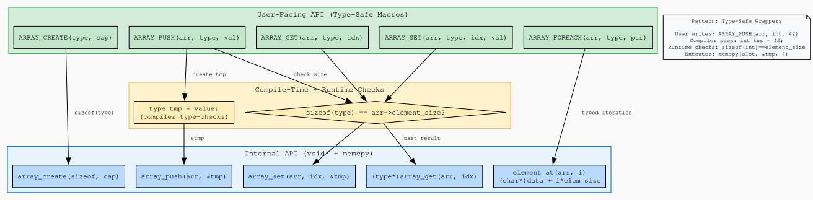

+++
title = "Type-Safe Wrappers: Macros That Protect Your void*"
author = ["pablo"]
date = 2026-06-08
draft = false
translationKey = "post-05-type-safe-wrappers"
series = ["Dynamic Arrays in C"]
seriesPost = 5
tags = ["c", "dynamic-array", "preprocessor-macros", "type-safety", "void-pointer", "generic-programming", "macro-patterns", "data-structures", "do-while-zero", "c11"]
description = "Add compile-time type checking to a void* dynamic array in C using preprocessor macros. ARRAY_PUSH, ARRAY_GET, and ARRAY_FOREACH catch size mismatches before they corrupt your data."
slug = "type-safe-wrapper-macros-void-pointer-dynamic-array-c"
+++

*Post 5 of the Dynamic Arrays in C series · [Full source code on GitHub](https://github.com/ansuzgs/dynamic-arrays-c/blob/main/src/post_05.c)*


## The Ergonomics Problem

[Post 4](../post-04-type-erasure/index.md) left us with a working generic array. One struct, one push function, one get function, stores any fixed-size type. The void* engine works. But using it is miserable.

To push an integer, you can't just write `array_push(arr, 42)`. You have to create a variable, then pass its address: `int x = 42; array_push(arr, &x);`. Two lines for something that should be one expression. To read a value back, you get a `void*` that you must cast manually: `int *val = (int *)array_get(arr, 0);`. Every access requires a cast. Every cast is an opportunity to lie to the compiler, write `double *val = (double *)array_get(arr, 0)` on an int array, and the compiler won't say a word. You'll get garbage at runtime and spend an hour wondering why.

This isn't a theoretical concern. In a real codebase with ten arrays of five different types, casting void* at every access point is a maintenance hazard. Someone will copy-paste a retrieval line, change the variable name but forget to change the cast, and introduce a silent corruption bug that only manifests under specific data patterns. Type erasure gave us flexibility; now it's giving us paper cuts.

The question for this post is: can we get the convenience of typed access, `ARRAY_PUSH(arr, int, 42)` as a single expression, `ARRAY_GET(arr, int, 0)` returning an `int*` without a manual cast, while keeping the single void* implementation underneath?

The answer is yes, and the tool is the C preprocessor. Macros let us write code that *generates* code. Specifically, we'll write macros that create a temporary variable of the right type (so the compiler checks the assignment), verify that `sizeof(type)` matches `arr->element_size` (catching mismatches at runtime), and delegate to the void* functions we already have. The user gets a type-safe API; the implementation remains generic.

This is not a novel pattern. Production C libraries use it everywhere. GLib's `g_array_append_val` is a macro that wraps a void* function. The Linux kernel's `container_of` is a macro that provides typed access to raw pointers. Sean Barrett's `stb_ds.h` takes this even further with macros that synthesize entire type-specific APIs. The pattern is old, proven, and worth understanding because it's the closest C gets to generics without code generation.

But macros have costs. They're hard to debug, when something goes wrong, the error message points to the expanded code, not the macro call. They can have surprising behavior with side effects (what happens if the "value" argument is `x++`?). They don't play well with IDE autocomplete or code analysis. And they add a layer of indirection that every reader of your code must mentally expand.

The tradeoff this post explores is *macro complexity vs type safety*. How much preprocessor machinery are you willing to add to prevent type errors? Where's the line between a helpful wrapper and an unreadable mess? And what can macros catch at compile time versus what they can only detect at runtime?

Let's build the wrapper layer.


## The Macros: What They Do

We build five macros on top of the existing void* API. The internal functions, `array_create`, `array_push`, `array_get`, `array_set`, `element_at`, are unchanged from [Post 4](../post-04-type-erasure/index.md). Everything in this post lives *above* that layer.

> The complete source, all macros, six demos, type mismatch detection, and the DOT generator, is available [on GitHub](https://github.com/ansuzgs/dynamic-arrays-c/blob/main/src/post_05.c).

### ARRAY_CREATE: Hiding sizeof

The simplest wrapper, replaces `array_create(sizeof(int), 8)` with `ARRAY_CREATE(int, 8)`:

```c
#define ARRAY_CREATE(type, capacity) \
    array_create(sizeof(type), (capacity))
```

One line. The caller specifies the type name; the macro computes `sizeof` for them. No room to get it wrong, you can't accidentally write `ARRAY_CREATE(int, 8)` and end up with `sizeof(double)`. The type name *is* the source of truth.

### ARRAY_PUSH: The Temporary Variable Trick

This is the central macro. It solves the "two-line push" problem:

```c
#define ARRAY_PUSH(arr, type, value)                                    \
    do {                                                                \
        if (sizeof(type) != (arr)->element_size) {                      \
            fprintf(stderr,                                             \
                "ARRAY_PUSH: type size mismatch (sizeof(%s)=%zu, "      \
                "element_size=%zu) at %s:%d\n",                         \
                #type, sizeof(type), (arr)->element_size,               \
                __FILE__, __LINE__);                                    \
        } else {                                                        \
            type _push_tmp = (value);                                   \
            array_push((arr), &_push_tmp);                              \
        }                                                               \
    } while (0)
```

Three things happen inside this macro:

First, the `do { ... } while(0)` wrapper. This is the standard C idiom for making multi-statement macros behave like a single statement. Without it, `if (cond) ARRAY_PUSH(arr, int, 42);` would break, the `if` would guard only the first statement of the expansion, and the rest would execute unconditionally. The `do/while(0)` wraps everything into one compound statement that the semicolon terminates cleanly.

Second, the size check. `sizeof(type)` is evaluated at compile time, it's a constant. `arr->element_size` is checked at runtime. If they don't match, the macro prints a diagnostic (including the file and line via `__FILE__` and `__LINE__`) and does *not* push anything. The array remains untouched. No corruption, no truncated bytes, no silent garbage.

Third, the temporary. `type _push_tmp = (value);` creates a local variable of the correct type and assigns the value to it. This is where the compiler does type checking, if `value` isn't assignable to `type`, you get a compile error. Then `&_push_tmp` is passed to the void* `array_push`. The temporary lives on the stack for the duration of the `do/while` block, long enough for `memcpy` to copy its bytes into the array.

The `#type` syntax (stringification) converts the type name to a string literal for the error message: `#int` becomes `"int"`, `#double` becomes `"double"`.

### ARRAY_GET: An Expression, Not a Statement

ARRAY_PUSH is a statement (it doesn't return a value). ARRAY_GET must be an expression, it returns a typed pointer. This means we can't use `do/while(0)`:

```c
#define ARRAY_GET(arr, type, index)                                     \
    ( sizeof(type) != (arr)->element_size                               \
      ? ( fprintf(stderr,                                               \
              "ARRAY_GET: type size mismatch (sizeof(%s)=%zu, "         \
              "element_size=%zu) at %s:%d\n",                           \
              #type, sizeof(type), (arr)->element_size,                 \
              __FILE__, __LINE__),                                      \
          (type *)NULL )                                                \
      : (type *)array_get((arr), (index)) )
```

This uses two less common C operators. The ternary (`? :`) checks the size match first. If sizes differ, it takes the error branch. If they match, it casts the result of `array_get` to `type*` and returns it.

The comma operator in the error branch does two things in sequence: `fprintf(stderr, ...)` prints the diagnostic (evaluated for its side effect), then `(type *)NULL` is the actual value of the expression. The result is: print an error *and* return NULL, all in one expression.

Usage is clean:

```c
int *val = ARRAY_GET(arr, int, 0);
if (val) printf("%d\n", *val);
```

No manual cast. The type is specified once, in the macro call, and the returned pointer is already `int*`.

### ARRAY_FOREACH: Iteration Without Casts

The foreach macro wraps a typed for-loop:

```c
#define ARRAY_FOREACH(arr, type, var_name)                              \
    for (size_t _fe_i = 0,                                              \
                _fe_ok = (sizeof(type) == (arr)->element_size);          \
         _fe_i < (arr)->size && _fe_ok;                                 \
         _fe_i++)                                                       \
        for (type *var_name = (type *)element_at((arr), _fe_i);         \
             var_name;                                                  \
             var_name = NULL)
```

The outer loop iterates `_fe_i` from 0 to `arr->size`. The inner loop is a trick: it declares `var_name` as a typed pointer, executes the body once (while `var_name` is non-NULL), then sets `var_name` to NULL to exit. This double-for pattern lets us declare a new variable in the loop header without relying on compiler-specific block scope extensions.

Usage reads almost like a for-each in a higher-level language:

```c
ARRAY_FOREACH(arr, int, val) {
    printf("%d\n", *val);
}
```


## The Code

The complete file compiles with `gcc -Wall -Wextra -std=c11` with zero warnings. It carries forward the void* core from [Post 4](../post-04-type-erasure/index.md) unchanged, adds the five macro wrappers, and includes six demonstrations that exercise every macro and show what happens when types mismatch.

The ASCII visualization adds a "macro layer" view, for each array state, it shows both the user-facing macro call and the internal void* operation it maps to, alongside the raw byte layout:

<pre style="width: fit-content; margin: 0 auto;">
╔════════════════════════════════════════════════════════════════════════╗
║  Array<int> via ARRAY_PUSH macro                                            ║
╠════════════════════════════════════════════════════════════════════════╣
║  Macro API:  ARRAY_CREATE(int, 8)                                      ║
║  Internal:   void* (erased)   element_size: 4    bytes                 ║
║  size: 5       capacity: 8       reallocs: 1                           ║
╠════════════════════════════════════════════════════════════════════════╣
║  API mapping (macro → internal):                                       ║
║    ARRAY_PUSH(arr, int, val)  → { int tmp=val; array_push(arr,&tmp); } ║
║    ARRAY_GET(arr, int, i)     → (int*)array_get(arr, i)                ║
╠════════════════════════════════════════════════════════════════════════╣
║  Memory layout:                                                        ║
║  [0] +0    │ 2a 00 00 00              │ 42                             ║
║  [1] +4    │ 63 00 00 00              │ 99                             ║
║  [2] +8    │ 07 00 00 00              │ 7                              ║
║  [3] +12   │ 00 01 00 00              │ 256                            ║
║  [4] +16   │ f3 ff ff ff              │ -13                            ║
║  [·] +20   │ -- -- -- --              │ (unused)                       ║
║  [·] +24   │ -- -- -- --              │ (unused)                       ║
║  [·] +28   │ -- -- -- --              │ (unused)                       ║
╠════════════════════════════════════════════════════════════════════════╣
║  20B used / 32B allocated = 62.5% utilization                          ║
╚════════════════════════════════════════════════════════════════════════╝
</pre>

The top section shows the two layers: the macro the user wrote (`ARRAY_CREATE(int, 8)`) and what the array actually stores internally (void*, element_size 4). The "API mapping" section spells out the transformation, `ARRAY_PUSH(arr, int, val)` becomes `{ int tmp=val; array_push(arr, &tmp); }`. Then the byte layout from [Post 4](../post-04-type-erasure/index.md), unchanged, because the memory is identical, the macros add zero overhead to the stored data.

<!-- IMAGE: outputs/post_05_api_layers.svg — Graphviz diagram showing the three-layer architecture: user-facing macros (green) → compile/runtime checks (yellow) → internal void* API (blue). Place this image here, full width. Alt text: "Architecture diagram showing how type-safe macros delegate through size checks to the internal void* and memcpy layer." -->


The Graphviz diagram shows the architecture from a different angle: the green layer (macros the user calls), the yellow layer (sizeof checks and typed temporaries), and the blue layer (the void* functions that actually manipulate memory). The arrows show how each macro delegates through the safety checks to the internal API.


## Try This and Watch It Fail

**Experiment 1: The Size Mismatch.** Create an array with `ARRAY_CREATE(int, 4)`. Push a value with `ARRAY_PUSH(arr, double, 3.14)`. Instead of silently copying 4 of 8 bytes (like raw void* would), the macro detects `sizeof(double)=8 != element_size=4` and refuses the push. Run the program and read the error message, it includes the file name, line number, and both sizes. The array is untouched.

**Experiment 2: Same-Size Different Types.** Create an array with `ARRAY_CREATE(int, 4)`. Push with `ARRAY_PUSH(arr, float, 3.14f)`. On most platforms, `sizeof(int) == sizeof(float) == 4`. The size check passes. The macro happily stores the float's bit pattern as if it were an int. Read it back with `ARRAY_GET(arr, int, 0)`, you'll get 1078523331 (the IEEE 754 representation of 3.14f interpreted as an integer). The macros can't catch this. This is the fundamental limitation of size-only checking.

**Experiment 3: Side Effects.** Call `ARRAY_PUSH(arr, int, x++)`. The macro expands `value` into `int _push_tmp = (x++);`. The increment happens once, correctly. Now imagine a badly written macro that evaluated `value` twice, you'd get `x++` evaluated twice, incrementing x by 2. This is why the temporary variable pattern matters: it evaluates the value expression exactly once.

**Experiment 4: Preprocessor Output.** Run `gcc -E post_05.c | grep -A 20 "_push_tmp"` to see the actual macro expansion. Compare it to the conceptual expansion shown in Demo 5. The real output is uglier (all on one line, no formatting), but structurally identical.


## Concepts and Tradeoffs

### What the Macros Can and Cannot Catch

The size check (`sizeof(type) != arr->element_size`) catches mismatches where the types have different sizes: int (4) vs double (8), char (1) vs int (4), a 20-byte struct vs a 12-byte struct. This covers the most dangerous cases, the ones where memcpy would copy the wrong number of bytes and corrupt adjacent memory.

What it cannot catch: types with identical sizes. `int` and `float` are both 4 bytes on most platforms. `unsigned int` and `signed int` are always the same size. A struct with two ints and a struct with one long are often 8 bytes each. For these cases, the size check passes, but the interpretation is wrong.

To detect same-size mismatches, you'd need either `typeof()` (a GCC/Clang extension, not standard C) or `_Generic` (standard C11). With `typeof`, you could compare the type of the value to the type used at array creation. With `_Generic`, you could dispatch to different handlers based on type. Both approaches add significant macro complexity and reduce portability. The size check is a pragmatic middle ground: it catches the most dangerous errors (different-size types) with minimal machinery.

### GCC Extensions vs Strict C11

The macros in this post use only standard C11 features: `sizeof`, `do/while(0)`, the comma operator, the ternary operator, stringification (`#`), and `__FILE__`/`__LINE__`. They compile with `-std=c11 -pedantic` on any conforming compiler.

If you're willing to restrict to GCC and Clang, `typeof()` opens up stronger checks. For example:

```c
/* GCC/Clang only, NOT used in this post */
#define ARRAY_PUSH_STRICT(arr, type, value)                     \
    do {                                                        \
        type _tmp = (value);                                    \
        _Static_assert(sizeof(type) == sizeof(typeof(_tmp)),    \
                       "type mismatch");                        \
        array_push((arr), &_tmp);                               \
    } while (0)
```

This gives a compile-time error if the type doesn't match, but it only works on compilers that support `typeof`. For a library intended to be portable across MSVC, GCC, Clang, and embedded compilers, the size-only runtime check is the safer choice.

### Macro Hygiene

Several details in the macro definitions are defensive measures:

Every argument is parenthesized in the expansion: `(arr)`, `(value)`, `(index)`. Without parentheses, `ARRAY_GET(arr, int, a + b)` would expand `index` to `a + b`, which could misbehave if the expansion contains operators with different precedence.

The temporary variable uses a prefixed name (`_push_tmp`, `_set_tmp`, `_fe_i`) to reduce the chance of shadowing a user variable. In production code, you'd use a double-underscore prefix or concatenate with `__LINE__` to generate unique names.

`ARRAY_PUSH` is a statement macro (do/while). `ARRAY_GET` is an expression macro (ternary). The distinction matters: you can't write `int *x = ARRAY_PUSH(...)` because it doesn't return a value, and you can't put `ARRAY_GET(...)` on a line by itself without assigning the result (though the compiler will accept it with a warning about an unused value).

### The Two-Layer Architecture

The pattern we've built is common enough to have a name: *two-layer API*. The internal layer (void* functions) is the engine, it handles all the memory management, growth, and byte copying. The external layer (macros) is the dashboard, it provides type safety, convenience, and diagnostics. The engine doesn't know about types. The dashboard doesn't know about memory.

This separation has a practical benefit beyond type safety: the internal layer is testable independently. You can write unit tests that call `array_push` directly with void*, verify byte layouts, and test edge cases (NULL arguments, overflow, allocation failure) without any macro involvement. The macros are a thin veneer, they add zero bytes to the stored data and zero branches to the hot path (the size check is constant-folded by any decent optimizer when the types match).


## Knowledge Test

> **Write a macro ARRAY_GET(arr, type, index) that returns a typed pointer. What happens if the user passes the wrong type?**

```c
#define ARRAY_GET(arr, type, index)                              \
    ( sizeof(type) != (arr)->element_size                        \
      ? ( fprintf(stderr, "type mismatch"), (type*)NULL )        \
      : (type *)array_get((arr), (index)) )
```

If the user passes the wrong type, say `ARRAY_GET(arr, double, 0)` on an int array, `sizeof(double)` (8) differs from `element_size` (4). The ternary takes the error branch: fprintf prints the mismatch, and the comma operator returns `(double*)NULL`. The array data is never accessed with the wrong type. No corruption, no undefined behavior.

What it cannot catch: if the user passes a type with the same sizeof (like `float` instead of `int`), the check passes. The bytes are reinterpreted through the wrong type, producing a valid but meaningless value. For same-size safety, you'd need `typeof()` or `_Generic`.


## What's Next

We have a generic array with a type-safe API. Push, get, set, iterate, all without manual casts or sizeof calculations. The macros catch the most dangerous type mismatches and produce clear diagnostics when they fire.

But we've been ignoring failures. What happens when `malloc` returns NULL? When `realloc` fails halfway through a growth? Right now, the functions print to stderr and return -1 or NULL, and the caller... ignores the return value entirely. Every `ARRAY_PUSH` in our demos throws away the error code. In production code, that's a crash waiting to happen.

In **Post 6: "When Things Go Wrong: Error Handling Strategies in C"**, we tackle allocation failure head-on. We'll implement push and insert functions that never corrupt the array on OOM, if `realloc` fails, the array remains in its pre-operation state. We'll compare three error propagation strategies (return codes, callbacks, and abort) and choose one. And we'll add the discipline of checking every return value, because in C, ignoring errors isn't optimism, it's a bug.

The type-safe macros we built today will carry forward into Post 6. The error handling will be added to the internal void* layer, and the macros will surface the errors to the caller without losing type safety.


*[Full source code on GitHub](https://github.com/ansuzgs/dynamic-arrays-c/blob/main/src/post_05.c)*
<!-- · Compile: `gcc -Wall -Wextra -std=c11 -o post_05 post_05.c` · Previous: [Type Erasure: Generic Arrays with void* and memcpy](04_type_erasure.md) · Next: [When Things Go Wrong: Error Handling Strategies in C](06_error_handling.md)* -->
