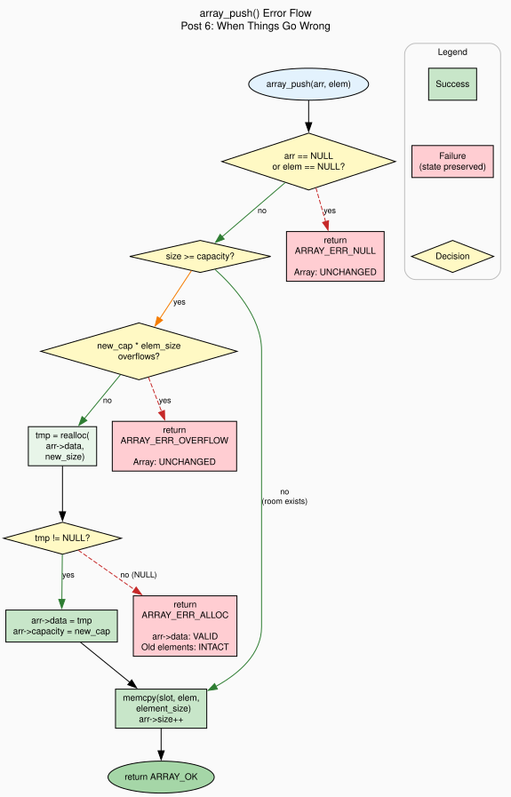

+++
title = "When Things Go Wrong: Error Handling Strategies in C"
author = ["pablo"]
date = 2026-06-11
draft = false
translationKey = "post-06-error-handling"
series = ["Dynamic Arrays in C"]
seriesPost = 6
tags = ["c", "dynamic-array", "error-handling", "realloc", "oom", "return-codes", "error-callbacks", "defensive-programming", "data-structures"]
description = "Implement push and insert that never corrupt array state on OOM. Compare return codes, callbacks, and abort as error strategies in C."
slug = "error-handling-strategies-realloc-failure-dynamic-array-c"
+++

*Post 6 of the Dynamic Arrays in C series · [Full source code on GitHub](https://github.com/ansuzgs/dynamic-arrays-c/blob/main/src/post_06.c)*


## The Error You've Been Ignoring

Every function we've written so far can fail. `array_create` calls `malloc`, twice. `array_push` calls [`realloc`](https://www.man7.org/linux/man-pages/man3/realloc.3p.html) when the buffer is full. Every one of those calls can return `NULL`, and every time it does, we've printed a message to stderr and returned -1 or NULL. That's the extent of our error handling: we report the problem and hope the caller notices.

The caller, meanwhile, has been doing this:

```c
ARRAY_PUSH(arr, int, 42);    /* return value? what return value? */
ARRAY_PUSH(arr, int, 43);
ARRAY_PUSH(arr, int, 44);
```

No checking. No error paths. Every push could fail, and our demo code throws away the evidence. In a short-lived program that allocates a few hundred bytes, this works fine, `malloc` won't fail because the system has gigabytes of RAM. But "works fine on my machine" is not error handling.

The moment your code runs on an embedded device with 64KB of heap, or inside a long-running server that's been allocating for days, or on a system where another process just consumed all available memory, that push will fail. And when it does, what happens to your array?

In Posts 1-5, the answer was: it depends. Sometimes the array is fine, the push failed before modifying anything. Sometimes it's in a half-modified state, we shifted elements for an insert but couldn't allocate room for the new one. And in the worst case, the array's data pointer is NULL because someone wrote `arr->data = realloc(arr->data, new_size)` and the realloc failed, losing both the pointer to the old buffer and all the data in it.

This post fixes all of that. We establish a hard invariant: **if an operation fails, the array is unchanged.** Same data pointer, same size, same capacity, same elements. The caller gets an error code that tells them exactly what went wrong, and the array is still in a usable state. They can retry, log the error, free the array, or degrade gracefully, whatever makes sense for their application.

To achieve this, we restructure every fallible function around a simple principle: do all the things that can fail *before* modifying any state. If the allocation succeeds, commit the changes. If it doesn't, there's nothing to roll back because nothing was changed yet.

We also need to decide how errors get communicated. C has no exceptions, no Result types, no try/catch. The three traditional approaches are: return codes (every function returns an int where 0 means success), errno-style globals (functions return the "natural" value and set a thread-local error variable), and callbacks (the user registers a handler and the library calls it on failure). Each has real tradeoffs, and the choice affects every function signature in your API.

This post implements return codes as the primary mechanism, adds an optional error callback for monitoring, and explains why `abort()`, the simplest strategy of all, is the wrong choice for library code. By the end, you'll have a clear error handling architecture that carries forward through the rest of the series.


## The Temporary Pointer: A Three-Line Pattern That Saves Your Data

Before we get into error codes and callbacks, we need to nail down the single most important pattern in this post. You saw it in [Post 2](../post-02-growing-pain/index.md), but it deserves a deeper treatment because getting it wrong is catastrophic.

When `realloc` fails, it returns `NULL`. Critically, **it does not free the original block.** Your old memory is still allocated, your old data is still there, and your old pointer is still valid. This is actually good design, it lets you recover. But only if you don't overwrite the pointer before checking.

The wrong way:

```c
/* DANGEROUS, DO NOT DO THIS */
arr->data = realloc(arr->data, new_size);
if (!arr->data) {
    /* Too late. arr->data is NULL. The old buffer is leaked.
     * Your data is gone AND memory is leaked. Double failure. */
}
```

The correct way:

```c
void *tmp = realloc(arr->data, new_size);
if (!tmp) {
    /* arr->data is still valid! All elements intact.
     * We can return an error and the caller continues. */
    return ARRAY_ERR_ALLOC;
}
arr->data = tmp;   /* Only update on success */
```

The temporary pointer costs one local variable. It prevents a double failure (data loss + memory leak) and enables the "array unchanged on error" invariant that everything else in this post depends on.


## Error Codes: Naming Your Failures

Posts 1-5 used ad-hoc integers: return -1 for failure, 0 for success. That's enough to signal "something went wrong," but it doesn't tell the caller *what* went wrong. Was it a null pointer? An allocation failure? An index out of bounds? An overflow? The caller can't distinguish these cases, which means they can't respond differently to each one.

We replace the magic numbers with an enum:

```c
typedef enum {
    ARRAY_OK          =  0,   /* Operation succeeded                    */
    ARRAY_ERR_NULL    = -1,   /* NULL pointer argument                  */
    ARRAY_ERR_ALLOC   = -2,   /* malloc or realloc failed               */
    ARRAY_ERR_BOUNDS  = -3,   /* Index out of range                     */
    ARRAY_ERR_OVERFLOW = -4,  /* Capacity calculation overflows size_t  */
    ARRAY_ERR_FULL    = -5,   /* Array at max capacity, cannot grow     */
    ARRAY_ERR_TYPE    = -6    /* Type size mismatch (from macro layer)  */
} ArrayError;
```

And a function that maps each code to a human-readable string:

```c
static const char *array_error_str(ArrayError err)
{
    switch (err) {
        case ARRAY_OK:           return "success";
        case ARRAY_ERR_NULL:     return "NULL pointer argument";
        case ARRAY_ERR_ALLOC:    return "memory allocation failed";
        case ARRAY_ERR_BOUNDS:   return "index out of bounds";
        case ARRAY_ERR_OVERFLOW: return "capacity overflow";
        case ARRAY_ERR_FULL:     return "array at maximum capacity";
        case ARRAY_ERR_TYPE:     return "type size mismatch";
    }
    return "unknown error";
}
```

Now every function returns `ArrayError` instead of `int`, and the caller can write meaningful error handling:

```c
ArrayError err = array_push(arr, &val);
if (err == ARRAY_ERR_ALLOC) {
    /* OOM: try freeing some caches and retry */
} else if (err != ARRAY_OK) {
    fprintf(stderr, "push failed: %s\n", array_error_str(err));
}
```

This is the foundation. Every function from here forward speaks the same error vocabulary.


## The Code

The full file compiles with zero warnings under `gcc -Wall -Wextra -Wpedantic -std=c11`, demonstrates five error scenarios, and generates ASCII visualization with error status. It also writes a Graphviz DOT file that diagrams the error flow through `array_push`.

> The complete source, all five demos, the error callback mechanism, the snapshot comparison system, and the DOT generator, is available [on GitHub](https://github.com/ansuzgs/dynamic-arrays-c/blob/main/src/post_06.c).

### The Safe Growth Function

The heart of the post is `array_ensure_capacity`, an internal function that guarantees room for a minimum number of elements. Everything that can fail is concentrated here:

```c
static ArrayError array_ensure_capacity(Array *arr, size_t min_capacity)
{
    if (arr->capacity >= min_capacity) {
        return ARRAY_OK;  /* Already have enough room */
    }

    /* Grow by 2x, but at least to min_capacity */
    size_t new_cap = arr->capacity * 2;
    if (new_cap < min_capacity) {
        new_cap = min_capacity;
    }

    /* Overflow check: can new_cap * element_size fit in size_t? */
    if (new_cap > SIZE_MAX / arr->element_size) {
        ARRAY_REPORT_ERROR(ARRAY_ERR_OVERFLOW,
            "array_ensure_capacity: new size overflows size_t");
        return ARRAY_ERR_OVERFLOW;
    }

    /* THE TEMPORARY POINTER PATTERN */
    size_t new_size = new_cap * arr->element_size;
    void *tmp = realloc(arr->data, new_size);
    if (!tmp) {
        ARRAY_REPORT_ERROR(ARRAY_ERR_ALLOC,
            "array_ensure_capacity: realloc failed");
        return ARRAY_ERR_ALLOC;
    }

    arr->data     = tmp;
    arr->capacity = new_cap;
    arr->realloc_count++;

    return ARRAY_OK;
}
```

Three things can go wrong here, in order: the capacity arithmetic overflows `size_t`, `realloc` returns `NULL`, or (implicitly) the `capacity * 2` calculation wraps around. Each is caught and reported before any state is modified. If any check fails, `arr->data`, `arr->size`, and `arr->capacity` are exactly what they were before the call.

The overflow check (`new_cap > SIZE_MAX / arr->element_size`) prevents a subtle but dangerous bug. If the array stores 1-byte elements and has grown to a capacity near `SIZE_MAX / 2`, doubling the capacity overflows `size_t` and wraps to a small number. Without the check, `realloc` would receive a tiny size, succeed, and then subsequent writes would overflow the buffer. The check catches this before the `realloc` call.

### Push: Check-Then-Act

With `array_ensure_capacity` handling all the allocation logic, push becomes almost trivial:

```c
ArrayError array_push(Array *arr, const void *element)
{
    if (!arr || !element) {
        ARRAY_REPORT_ERROR(ARRAY_ERR_NULL, "array_push: NULL argument");
        return ARRAY_ERR_NULL;
    }

    /* Step 1: ensure room, if this fails, arr is unchanged */
    ArrayError err = array_ensure_capacity(arr, arr->size + 1);
    if (err != ARRAY_OK) {
        return err;  /* Propagate. Array untouched. */
    }

    /* Step 2: copy element, cannot fail */
    memcpy(element_at(arr, arr->size), element, arr->element_size);

    /* Step 3: update bookkeeping, cannot fail */
    arr->size++;

    return ARRAY_OK;
}
```

The pattern is check-then-act: do everything that can fail (step 1) before doing anything that modifies state (steps 2 and 3). `memcpy` doesn't allocate, it can't fail. Incrementing `size` is arithmetic, it can't fail. So if we get past step 1, the operation will complete successfully. And if step 1 fails, we haven't touched the array.

### Insert: The Harder Case

Insert at an arbitrary position requires shifting existing elements to make room. The order of operations matters:

```c
ArrayError array_insert(Array *arr, size_t index, const void *element)
{
    if (!arr || !element) {
        ARRAY_REPORT_ERROR(ARRAY_ERR_NULL, "array_insert: NULL argument");
        return ARRAY_ERR_NULL;
    }

    if (index > arr->size) {
        ARRAY_REPORT_ERROR(ARRAY_ERR_BOUNDS,
                           "array_insert: index out of range");
        return ARRAY_ERR_BOUNDS;
    }

    /* Step 1: ensure capacity, BEFORE shifting */
    ArrayError err = array_ensure_capacity(arr, arr->size + 1);
    if (err != ARRAY_OK) {
        return err;
    }

    /* Step 2: shift elements right (memmove for overlapping regions) */
    if (index < arr->size) {
        void *dst = element_at(arr, index + 1);
        void *src = element_at(arr, index);
        size_t bytes = (arr->size - index) * arr->element_size;
        memmove(dst, src, bytes);
    }

    /* Step 3: copy new element into the gap */
    memcpy(element_at(arr, index), element, arr->element_size);
    arr->size++;

    return ARRAY_OK;
}
```

Why ensure capacity *first*, shift *second*? If we shifted first and then the allocation failed, we'd have elements in the wrong positions with no new element to fill the gap, the array would be corrupted. By ensuring capacity first, we know the shift will have room to work, and we know the overall operation will succeed.

Note the use of [`memmove`](https://man7.org/linux/man-pages/man3/memmove.3.html) instead of [`memcpy`](https://man7.org/linux/man-pages/man3/memcpy.3.html) for the shift. When shifting elements right, the source and destination regions overlap, `memmove` handles this correctly by copying in the right direction. `memcpy`'s behavior with overlapping regions is undefined.

### The Error Callback

The callback is an optional monitoring layer. The user registers a function; the library calls it whenever an error occurs:

```c
typedef void (*ArrayErrorCallback)(ArrayError err, const char *msg,
                                   const char *file, int line);

static ArrayErrorCallback g_error_callback = NULL;

void array_set_error_callback(ArrayErrorCallback cb)
{
    g_error_callback = cb;
}
```

Every function reports errors through a macro that invokes the callback if one is registered:

```c
#define ARRAY_REPORT_ERROR(err, msg) \
    do { \
        if (g_error_callback) { \
            g_error_callback((err), (msg), __FILE__, __LINE__); \
        } \
    } while (0)
```

The callback receives the error code, a descriptive message, and the source location where the error was detected. It's called *in addition to* the return code, not instead of it. The callback is for centralized logging, alerting, or metrics. The return code is for control flow.

This separation is important: the callback doesn't control whether the operation retries or aborts. It observes. The caller, who holds the return code, decides what to do.

<!-- IMAGE: outputs/post_06_error_flow.svg, Graphviz diagram showing the success path (green arrows) and failure paths (red dashed arrows) through array_push(). Place this image here, full width. Alt text: "Flowchart showing array_push error flow: entry → null check → capacity check → overflow check → realloc → success path (green) versus three failure paths (red, dashed) that each return a specific error code and leave the array unchanged." -->


### The ARRAY_PUSH_ERR Macro

[Post 5](../post-05-type-safe-wrappers/index.md)'s `ARRAY_PUSH` macro discards the return value, it's a statement macro, and the error code from `array_push` has nowhere to go. For code that needs to check errors through the macro layer, we add a variant:

```c
#define ARRAY_PUSH_ERR(arr, type, value, err_var)                  \
    do {                                                           \
        if (sizeof(type) != (arr)->element_size) {                 \
            (err_var) = ARRAY_ERR_TYPE;                            \
        } else {                                                   \
            type _push_tmp = (value);                              \
            (err_var) = array_push((arr), &_push_tmp);             \
        }                                                          \
    } while (0)
```

Usage:

```c
ArrayError err;
ARRAY_PUSH_ERR(arr, int, 42, err);
if (err != ARRAY_OK) {
    /* handle it */
}
```

The caller passes a variable to receive the error code. The macro checks the type (as in [Post 5](../post-05-type-safe-wrappers/index.md)) and stores the result of `array_push` in the variable. Type mismatches get `ARRAY_ERR_TYPE` without calling `array_push` at all, the macro layer catches it before the void* layer even sees the request.


## State Preservation: Proof by Snapshot

The "unchanged on failure" guarantee is the core promise of this post. To verify it concretely, the code includes a snapshot mechanism that captures the array's state before and after a failing operation, then compares the two:

<pre style="width: fit-content; margin: 0 auto;">
  ┌─ State comparison: after failed insert
  │  data pointer:  SAME ✓ (before=0x55da..., after=0x55da...)
  │  size:          SAME ✓ (before=4, after=4)
  │  capacity:      SAME ✓ (before=4, after=4)
  │  first element: SAME ✓ (before=10, after=10)
  │  last element:  SAME ✓ (before=40, after=40)
  └─
</pre>

Every field matches. The array after the failed operation is bitwise identical to the array before it. The caller can continue pushing, iterating, or freeing as if the failing call never happened.

The ASCII visualization reinforces this by showing the error status alongside the array state:

<pre style="width: fit-content; margin: 0 auto;">
╔══════════════════════════════════════════════════════════╗
║  After failed operation, unchanged                       ║
║  Last operation: index out of bounds                     ║
╠══════════════════════════════════════════════════════════╣
║  type: int       element_size: 4     reallocs: 0         ║
║  size: 4         capacity: 4                             ║
╠══════════════════════════════════════════════════════════╣
║  [ 0] +0     │ 10                                        ║
║  [ 1] +4     │ 20                                        ║
║  [ 2] +8     │ 30                                        ║
║  [ 3] +12    │ 40                                        ║
╠══════════════════════════════════════════════════════════╣
║  16B used / 16B allocated = 100.0% utilization           ║
╚══════════════════════════════════════════════════════════╝
</pre>

The error message tell you the last operation failed. The array contents tell you nothing was damaged. After the failure, the next push succeeds normally, the array doesn't hold a grudge.


## Concepts and Tradeoffs

### Return Codes vs Callbacks vs Abort

The three strategies occupy different points on the simplicity-flexibility spectrum.

**Return codes** (what we use as primary mechanism) are the most explicit approach. Every function returns `ArrayError`. The caller checks it immediately and decides how to react. The code is verbose, you need an `if` after every call, but the error path is visible, debuggable, and impossible to miss in a code review. The downside is that it's easy to *not* check: `array_push(arr, &val);` compiles without warnings even though the return value is discarded. GCC's [`__attribute__((warn_unused_result))`](https://gcc.gnu.org/onlinedocs/gcc/Common-Function-Attributes.html) can help, but it's not standard C.

**Callbacks** (our optional monitoring layer) add centralized error handling without changing call sites. You register a handler once, and every error in the library flows through it. This is excellent for logging, metrics, and alerting, you don't need to add logging at every call site. The drawback is that the callback is global state: in a multithreaded program, you'd need it to be thread-local or protected by a mutex. And the callback can't control the function's behavior, it observes but doesn't decide. If the callback could abort the operation or retry, you'd need a much more complex protocol (longjmp, or returning a "retry" flag), and the library's control flow would become hard to reason about.

**Abort** (calling `abort()` or `exit()` on any failure) is the simplest strategy. If anything goes wrong, the program terminates. No error paths, no error codes, no checking. For a quick prototype or a command-line tool where any failure is unrecoverable, this is honest and efficient. For library code, it's hostile: you're deciding for the caller that every allocation failure is fatal. A web server embedding your library would crash entirely because one request's array couldn't grow. A game engine would terminate mid-frame instead of dropping the operation and continuing. Library code should report errors, not enforce consequences.

Our choice: return codes as the primary mechanism, with callbacks as an optional layer for monitoring. This gives the caller maximum control (they check the code and decide) while allowing centralized logging (the callback observes everything). Abort is never called from library code, if the caller wants fail-fast behavior, they can write a one-line wrapper: `void push_or_die(Array *arr, const void *elem) { if (array_push(arr, elem) != ARRAY_OK) abort(); }`.

### The Overflow Nobody Checks

Before calling `realloc(arr->data, new_cap * arr->element_size)`, we check whether `new_cap * arr->element_size` overflows `size_t`. Most tutorials skip this. The reasoning is that `size_t` is 64 bits on modern systems, and nobody has 18 exabytes of RAM, so the multiplication can't overflow in practice.

This is true for typical desktop programs. It's not true for all programs. An array with `element_size = 1` and capacity near `SIZE_MAX / 2` (roughly 9 × 10¹⁸ on a 64-bit system) would overflow when doubled. More realistically, on a 32-bit embedded system where `size_t` is 32 bits, `SIZE_MAX` is about 4 billion. An array of 2048-byte structs hits overflow at a capacity of about 2 million, large but not absurd.

The check costs one division per growth event. Growth events are rare (about log₂(n) for n pushes). The cost is negligible; the protection is real.

### Why Not errno?

The C standard library uses [`errno`](https://man7.org/linux/man-pages/man3/errno.3.html), a global (or thread-local) variable that functions set on failure. The caller checks `errno` after the call to determine what went wrong. This approach has a well-known set of problems for library code: `errno` can be overwritten by any other function call between the failure and the check, including functions inside the error handling code itself (like `fprintf`, which can set `errno`). The caller must save `errno` before doing anything else, which is easy to forget. And `errno` values are integers, no type safety, no way to distinguish your library's errors from the system's.

Return codes avoid all of these problems: the error is the return value, it can't be overwritten by other calls, and the enum type gives you named constants instead of magic numbers.

### The Cost of Checking Everything

Adding error checks to every function adds code. `array_push` went from 8 lines ([Post 5](../post-05-type-safe-wrappers/index.md)) to 12 lines. `array_insert` is 18 lines instead of 10. The `ARRAY_PUSH_ERR` macro adds 8 lines of preprocessor code. Every call site needs 3-4 lines of checking instead of 1 line of fire-and-forget.

Is this worth it? In library code, yes. The alternative is silent corruption, and debugging silent corruption in C, where the symptom often appears thousands of lines away from the cause, is significantly more expensive than writing the checks. In application code that's using the library, you can choose your own comfort level: check every return in critical paths, use the unchecked `ARRAY_PUSH` macro in prototype code, or write an `_or_die` wrapper for scripts.

The error checks don't affect performance in the success path. The NULL checks are a single comparison, branch-predicted as not-taken. The overflow check is one division per growth event (rare). The callback check is a NULL pointer comparison. On modern CPUs, these are effectively free.


## Try This and Watch It Break

**Experiment 1: Remove the Temporary Pointer.** In `array_ensure_capacity`, change `void *tmp = realloc(...)` to `arr->data = realloc(...)`. Then simulate a realloc failure (you can do this by setting a very large size, or by using a custom allocator that fails after N calls). Watch how the array's data pointer becomes NULL while the old buffer leaks. Valgrind will report both a leak and a use-after-free if you try to access elements afterward.

**Experiment 2: Swap Insert Order.** In `array_insert`, move the `memmove` call *before* `array_ensure_capacity`. Push 4 elements to fill a capacity-4 array. Then insert at index 0. The `memmove` will try to write beyond the buffer (there's no room for the shifted elements), triggering a heap-buffer-overflow. Compile with `-fsanitize=address` to see [AddressSanitizer](https://clang.llvm.org/docs/AddressSanitizer.html) catch it.

**Experiment 3: Overflow Detection.** On a 64-bit system, try `array_create(SIZE_MAX, 2)`. The overflow check catches it: `SIZE_MAX > SIZE_MAX / 2` is false (division yields `SIZE_MAX / 2`), but `2 > SIZE_MAX / SIZE_MAX` is also false. Trace through the actual check in the code to understand which condition fires and why.

**Experiment 4: Callback Chaining.** Register an error callback that counts errors. Then run a loop that pushes to a NULL array 1000 times. Verify the callback count matches the number of failed pushes. This pattern is useful for testing: you can assert that your code triggers the expected number and type of errors.


## Knowledge Test

> **If realloc fails, what value does `arr->data` still hold? Why must you use a temporary pointer?**

`arr->data` still holds its original value, the pointer to the existing, valid buffer with all elements intact. When `realloc` fails, it returns `NULL` but does **not** free the original block. The old memory is still allocated and usable.

You must use a temporary pointer because if you write `arr->data = realloc(arr->data, new_size)` and realloc returns `NULL`, then `arr->data` becomes `NULL`. The old buffer is still allocated (realloc didn't free it), but no pointer references it anymore. You've lost your data *and* leaked the memory. The temporary pointer (`void *tmp = realloc(...)`) stores the result separately, if it's `NULL`, `arr->data` is never touched, and the array continues to work with its existing buffer.


## What's Next

We have an array that handles errors without corrupting state, communicates failures through named error codes, and supports optional error callbacks for monitoring. Every operation either succeeds completely or fails cleanly, leaving the array unchanged.

But we're still limited in what we can *do* with the array: push, get, set, insert. We can't sort it, search it, or iterate with a custom operation. We can't register a destructor that cleans up complex elements when the array is destroyed. All of these operations require one thing we haven't used yet: function pointers.

In **Post 7: "Function Pointers and Callbacks: Sort, Search, Destroy"**, we add `array_sort()` (using qsort-compatible comparators), `array_find()`, `array_foreach()`, and element destructor callbacks. Function pointers are C's mechanism for polymorphism, they let you pass behavior as data, so the array can sort integers by value or structs by name without knowing anything about the type. The error handling architecture from this post carries forward: every new function returns `ArrayError`, and the callback mechanism logs failures in sort comparators and destructor functions.


*[Full source code on GitHub](https://github.com/ansuzgs/dynamic-arrays-c/blob/main/src/post_06.c)*
<!-- · Compile: `gcc -Wall -Wextra -std=c11 -o post_06 post_06.c` · Previous: [Type-Safe Wrappers: Macros That Protect Your void*](05_type_safe_wrappers.md) · Next: [Function Pointers and Callbacks: Sort, Search, Destroy](07_function_pointers.md)* -->
