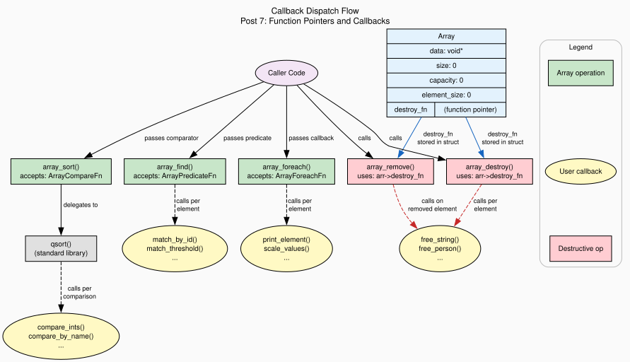

+++
title = "Function Pointers and Callbacks: Sort, Search, Destroy"
author = ["pablo"]
date = 2026-06-18
draft = false
translationKey = "post-07-function-pointers"
series = ["Dynamic Arrays in C"]
seriesPost = 7
tags = ["c", "dynamic-array", "function-pointers", "callbacks", "qsort", "comparator", "destructor", "foreach", "generic-programming", "data-structures"]
description = "Add array_sort(), array_find(), array_foreach(), and element destructors to a generic C array using function pointers and qsort-compatible callbacks."
slug = "function-pointers-callbacks-sort-search-destroy-c"
+++

*Post 7 of the Dynamic Arrays in C series · [Full source code on GitHub](https://github.com/ansuzgs/dynamic-arrays-c/blob/main/src/post_07.c)*

## Passing Behavior as Data

Our array can store any type, grow on demand, handle errors without corrupting state, and communicate failures through typed error codes. What it cannot do is anything *interesting* with the elements inside it. We can push, get, set, and insert, operations that treat the elements as opaque byte blobs. We can't sort the array because sorting requires knowing how to compare two elements. We can't search it because searching requires knowing what "matching" means. We can't even destroy it properly when the elements own heap-allocated resources, because the array doesn't know how to clean them up.

All of these problems have the same shape: the array needs to perform an operation that depends on the *type* of the stored elements, but type erasure means the array doesn't know the type. The solution in C is function pointers, passing a *function* as an argument to another function, so the caller can inject type-specific behavior into a type-agnostic algorithm.

The concept is simple. A function pointer is a variable that stores the address of a function instead of the address of data. You can assign functions to it, pass it as an argument, store it in a struct, and call it through the pointer. When `qsort` needs to know whether element A comes before element B, it doesn't hardcode the comparison, it calls a function pointer that the caller provided. The caller writes a 5-line comparator function that knows the type, and `qsort` uses it without ever knowing what type it's sorting.

The syntax, however, is the worst in C. A function pointer declaration reads inside-out:

```c
int (*compare)(const void *a, const void *b);
```

This declares `compare` as a pointer to a function that takes two `const void*` arguments and returns `int`. The parentheses around `(*compare)` are mandatory, without them, `int *compare(const void *, const void *)` declares a function returning `int*`, not a pointer to a function returning `int`. The ambiguity is a parsing artifact from C's declaration syntax, and every C programmer trips over it at least once.

The standard remedy is `typedef`:

```c
typedef int (*ArrayCompareFn)(const void *a, const void *b);
```

Now `ArrayCompareFn` is a type, and you can use it in function signatures like any other type: `ArrayError array_sort(Array *arr, ArrayCompareFn compare)`. The ugliness is quarantined to one line.

This post adds four callback-driven operations to the array: `array_sort()` delegates to `qsort` with a user-provided comparator. `array_find()` performs linear search with a predicate callback. `array_foreach()` iterates the array and calls a user function on each element, passing an optional context pointer that serves as C's version of a closure. And the `destroy_fn` field, a function pointer stored in the struct itself, gives the array the ability to clean up elements that own heap-allocated memory.

The comparator design forces a decision that every C library faces: do we use `qsort`'s signature (standard, universally recognized, requires ugly double-dereference for pointer types) or a custom signature (cleaner, supports a context parameter, but incompatible with the standard library)? We use `qsort`'s signature, and this post explains exactly why, and exactly where it hurts.


## The Code

The full file compiles with zero warnings under `gcc -Wall -Wextra -std=c11`, runs six demonstrations (sorting integers, sorting structs by different fields, searching with predicates, iterating with context, destructors for owned resources, and the qsort double-dereference subtlety), and generates both ASCII visualization and a Graphviz DOT file.

> The complete source, all six demos, the callback-driven API, the destructor mechanism, and the DOT generator, is available [on GitHub](https://github.com/ansuzgs/dynamic-arrays-c/blob/main/src/post_07.c).

### The Callback Types

We define four function pointer types, each `typedef`'d for readability:

```c
/* Comparator: qsort-compatible. Returns <0, 0, or >0. */
typedef int (*ArrayCompareFn)(const void *a, const void *b);

/* Destructor: called on each element when the array is destroyed. */
typedef void (*ArrayDestroyFn)(void *element);

/* Foreach: called once per element during iteration. */
typedef void (*ArrayForeachFn)(void *element, void *context);

/* Predicate: returns non-zero if the element matches. */
typedef int (*ArrayPredicateFn)(const void *element, const void *context);
```

Each follows the same pattern: the callback receives a `void*` pointer to the element (or `const void*` for read-only operations), and optionally a context pointer. The context pointer is worth highlighting, it's how C simulates closures. In JavaScript, you'd capture a variable from the enclosing scope. In C, you pack your variables into a struct and pass a pointer as `context`. It's manual, but it works without heap allocation and is transparent to the debugger.

### The Struct: One New Field

The only structural change from [Post 6](../post-06-error-handling) is the `destroy_fn` field:

```c
typedef struct {
    void          *data;           /* Opaque heap buffer                */
    size_t         size;           /* Elements currently stored          */
    size_t         capacity;       /* Slots allocated                    */
    size_t         element_size;   /* Bytes per element                  */
    size_t         realloc_count;  /* Diagnostic: growth events          */
    ArrayDestroyFn destroy_fn;     /* NEW: per-element cleanup (or NULL) */
} Array;
```

This callback is stored in the struct, not passed as an argument, because it's a *property* of the array, not of a single operation. The destructor applies to every destroy and remove operation for the lifetime of the array. You set it once after creation and forget about it:

```c
Array *arr = array_create(sizeof(char *), 8);
array_set_destroy_fn(arr, destroy_string);
/* From now on, array_destroy and array_remove will free each string */
```

### array_sort(): Delegating to qsort

The sort function is a thin wrapper around the standard library's `qsort()`:

```c
ArrayError array_sort(Array *arr, ArrayCompareFn compare)
{
    if (!arr) {
        ARRAY_REPORT_ERROR(ARRAY_ERR_NULL, "array_sort: NULL array");
        return ARRAY_ERR_NULL;
    }
    if (!compare) {
        ARRAY_REPORT_ERROR(ARRAY_ERR_NULL, "array_sort: NULL comparator");
        return ARRAY_ERR_NULL;
    }

    if (arr->size > 1) {
        qsort(arr->data, arr->size, arr->element_size, compare);
    }

    return ARRAY_OK;
}
```

`qsort` already knows how to sort a contiguous buffer of elements, it just needs to know how many elements there are (`arr->size`), how big each one is (`arr->element_size`), where the buffer starts (`arr->data`), and how to compare two elements (`compare`). Our generic array stores exactly this information, so the delegation is natural.

### array_find(): Linear Search with Predicate

```c
void *array_find(const Array *arr, ArrayPredicateFn predicate,
                 const void *context, size_t *out_index)
{
    if (!arr || !predicate) return NULL;

    for (size_t i = 0; i < arr->size; i++) {
        void *elem = element_at(arr, i);
        if (predicate(elem, context)) {
            if (out_index) *out_index = i;
            return elem;
        }
    }

    return NULL;
}
```

The predicate receives each element and a context (the search key or any other criteria), and returns non-zero on a match. The caller writes the predicate, so any search criterion is possible: match by ID, by name prefix, by threshold, by complex multi-field condition. The function returns a pointer to the first matching element, or NULL if none matches. The optional `out_index` parameter stores the index for callers who need it.

### array_foreach(): Iteration with Context

```c
ArrayError array_foreach(Array *arr, ArrayForeachFn fn, void *context)
{
    if (!arr || !fn) {
        ARRAY_REPORT_ERROR(ARRAY_ERR_NULL, "array_foreach: NULL argument");
        return ARRAY_ERR_NULL;
    }

    for (size_t i = 0; i < arr->size; i++) {
        fn(element_at(arr, i), context);
    }

    return ARRAY_OK;
}
```

The callback receives a *non-const* pointer, it can modify elements in place. This is intentional: `foreach` is used for both read-only operations (summing scores, printing) and mutations (applying a curve, normalizing values). The context pointer carries any state the callback needs. For a sum operation, it's a pointer to an accumulator. For a scaling operation, it's a pointer to the scale factor. No globals required.

### array_remove(): Destroy Before Shift

```c
ArrayError array_remove(Array *arr, size_t index)
{
    if (!arr) { /* ... error ... */ }
    if (index >= arr->size) { /* ... error ... */ }

    /* Step 1: destroy the element being removed */
    if (arr->destroy_fn) {
        arr->destroy_fn(element_at(arr, index));
    }

    /* Step 2: shift elements left to fill the gap */
    if (index < arr->size - 1) {
        void *dst = element_at(arr, index);
        void *src = element_at(arr, index + 1);
        size_t bytes = (arr->size - index - 1) * arr->element_size;
        memmove(dst, src, bytes);
    }

    arr->size--;
    return ARRAY_OK;
}
```

The order matters: destroy *then* shift. If we shifted first, the element's memory would be overwritten by the next element before the destructor could read it. If we destroyed after, the destructor would see the wrong element (the one that shifted into the slot). Destroy → shift → decrement is the only safe sequence.


<!-- IMAGE: outputs/post_07_callback_dispatch.svg, Graphviz diagram showing the Array struct with its destroy_fn field, the four callback-driven operations (sort, find, foreach, destroy/remove), and the user-provided callback functions they dispatch to. Place this image here, full width. Alt text: "Diagram showing how the Array struct and its operations dispatch to user-provided callback functions: sort delegates to qsort which calls a comparator, find calls a predicate, foreach calls a user function, and destroy/remove call the stored destructor." -->


## The qsort Comparator: Why It's Ugly and Why We Use It Anyway

The most confusing aspect of function pointers in C is the `qsort` comparator contract, specifically what happens with pointer types.

When the array stores **value types** (int, float, Person struct), each element sits directly in the buffer. `qsort` passes a pointer to each element's location. If the buffer holds `int` values, each comparator argument is an `int*` (cast to `const void*`). One level of indirection:

```c
int compare_ints(const void *a, const void *b) {
    int va = *(const int *)a;   /* One dereference: void* → int */
    int vb = *(const int *)b;
    return (va > vb) - (va < vb);
}
```

When the array stores **pointer types** (char\*, Person\*), each element in the buffer is itself a pointer. `qsort` passes a pointer to each element, a pointer to a pointer. If the buffer holds `char*` values, each argument is a `char**` (cast to `const void*`). Two levels of indirection:

```c
int compare_strings(const void *a, const void *b) {
    const char *const *sa = (const char *const *)a;  /* void* → char** */
    const char *const *sb = (const char *const *)b;
    return strcmp(*sa, *sb);   /* Dereference once: char** → char* */
}
```

The rule is mechanical: `qsort` always gives you `&buffer[i]`, which is a pointer to whatever the buffer stores. For type T, you get T\*. For type T\*, you get T\*\*. The extra level of indirection is not a design flaw, it's a consequence of `qsort` not knowing (and not needing to know) what the elements are.

Here's the output from the demo that makes this visible:

<pre style="width: fit-content; margin: 0 auto;">
╔════════════════════════════════════════════════════════╗
║  Unsorted strings                                      ║
╠════════════════════════════════════════════════════════╣
║  type: char*     element_size: 8     reallocs: 0       ║
║  size: 4         capacity: 4                           ║
║  destroy_fn: SET (elements will be cleaned up)         ║
╠════════════════════════════════════════════════════════╣
║  [ 0] +0     │ "delta"                                 ║
║  [ 1] +8     │ "alpha"                                 ║
║  [ 2] +16    │ "charlie"                               ║
║  [ 3] +24    │ "bravo"                                 ║
╠════════════════════════════════════════════════════════╣
║  32B used / 32B allocated = 100.0% utilization         ║
╚════════════════════════════════════════════════════════╝

  (after sort)

╔════════════════════════════════════════════════════════╗
║  Sorted strings (alphabetical)                         ║
╠════════════════════════════════════════════════════════╣
║  [ 0] +0     │ "alpha"                                 ║
║  [ 1] +8     │ "bravo"                                 ║
║  [ 2] +16    │ "charlie"                               ║
║  [ 3] +24    │ "delta"                                 ║
╠════════════════════════════════════════════════════════╣
║  32B used / 32B allocated = 100.0% utilization         ║
╚════════════════════════════════════════════════════════╝
</pre>

Note `element_size: 8`, each element is a pointer (8 bytes on a 64-bit system), not a string. The strings live on the heap; the buffer holds addresses. The `destroy_fn: SET` line tells you the destructor is registered and will free those strings when the array is destroyed.

## The Destructor: Solving the Ownership Problem

[Post 4](../post-04-type-erasure) raised a question we deferred: when the array stores pointers to heap-allocated data, who frees that data? The array owns its buffer, it allocated it, it reallocs it, it frees it on destroy. But the buffer holds *copies of pointers*, not the data those pointers reference. Destroying the array frees the buffer (and the pointer copies inside it), but the pointed-to memory, the strings, the structs, the whatever, remains allocated. Leaked.

The destructor callback solves this. You register a function that knows how to clean up one element:

```c
static void destroy_string(void *element)
{
    char **str_ptr = (char **)element;
    free(*str_ptr);       /* Free the string on the heap */
    *str_ptr = NULL;      /* Defensive: prevent use-after-free */
}
```

The callback receives a pointer to the element's slot in the buffer. For `char*` elements, that's a `char**`, the same double-dereference pattern as the comparator. You dereference once to get the `char*` (the heap address), then free it.

`array_destroy` calls this on every live element before freeing the buffer:

```c
void array_destroy(Array *arr)
{
    if (!arr) return;

    if (arr->destroy_fn) {
        for (size_t i = 0; i < arr->size; i++) {
            void *elem = (char *)arr->data + i * arr->element_size;
            arr->destroy_fn(elem);
        }
    }

    free(arr->data);
    free(arr);
}
```

The order is: destroy elements → free buffer → free struct. If we freed the buffer first, the destructor would be reading freed memory. If we freed the struct first, we'd lose the pointer to the buffer. This ordering is the only correct one, and it mirrors the construction order in reverse, a pattern you'll see in every resource-managing destructor in C.


## Concepts and Tradeoffs

### qsort-Compatible vs Custom Comparator Signature

The standard `qsort` comparator takes two `const void*` arguments and returns `int`. It has no context parameter, if your comparison needs external state (a locale for string comparison, a field selector, a weight table), you must use a global variable or a thread-local.

A custom signature could be cleaner:

```c
typedef int (*CustomCompareFn)(const void *a, const void *b, void *context);
```

The context parameter eliminates the need for globals. It also lets you write one comparator that sorts by any field, with the field specified at call time. Some modern libraries (glib's `g_qsort_with_data`, BSD's `qsort_r`) use this pattern.

We chose the standard signature for three reasons. First, every C programmer already knows it, the comparator from `qsort` works unchanged in `array_sort`. Second, comparators written for our library work with `qsort`, `bsearch`, and any other standard-library function that takes the same signature. Third, the double-dereference for pointer types, while ugly, is a concept you need to understand anyway, it appears everywhere in systems code, and avoiding it would leave a gap in the reader's understanding.

The tradeoff is real: you lose the context parameter, which means comparators that need external state must use globals. For this series, where demos are single-threaded and comparators are simple, that's acceptable. In a production library, `qsort_r`-style context would be worth the compatibility cost.

### Destructor as Struct Field vs Function Argument

We store the destructor in the struct rather than passing it to `array_destroy`. This is a design choice with consequences.

Storing it in the struct means you set it once and it applies everywhere: `array_destroy`, `array_remove`, any future `array_clear` or `array_pop`. You can't forget to pass it. The downside is that the destructor is global to the array, you can't have different cleanup logic for different removal operations.

Passing it as an argument (`array_destroy(arr, destroy_fn)`) would be more flexible: you could use different destructors in different contexts. But it's also more error-prone: forget to pass the destructor once and you have a leak. For a container that manages owned resources, the "set once, forget" model is safer.

### The Subtraction Trap in Comparators

Many tutorials show integer comparators as `return a - b`. This works for small values but overflows for extreme ones: `INT_MAX - (-1)` wraps to a negative number, producing incorrect sort order. The safe pattern uses explicit comparison:

```c
return (va > vb) - (va < vb);
```

This produces -1, 0, or 1 without any arithmetic that could overflow. The relational operators return 0 or 1, so the expression is always in range. It's one more thing to remember, but it eliminates a class of bugs that only appear with extreme input values, the kind of bug that passes every test and fails in production.

### Performance: The Callback Tax

Each callback-driven operation adds function call overhead per element. `array_foreach` calls the callback N times. `array_sort` calls the comparator O(N log N) times. `array_find` calls the predicate up to N times. On modern CPUs, a function call through a pointer costs roughly 2-5 nanoseconds more than an inlined comparison (the indirect call prevents branch prediction).

For most programs, this is negligible. For hot loops processing millions of elements per second, it matters. C++ solves this with templates (the comparator is inlined at compile time). C can partially solve it with macros (generate a type-specific sort function that inlines the comparison), but that trades code size and readability for performance. We stay with callbacks because the pedagogical clarity is worth more than the nanoseconds.


## Try This and Watch It Break

**Experiment 1: Remove the Destructor.** Comment out the `array_set_destroy_fn(arr, destroy_string)` call in Demo 5. Compile with `-fsanitize=leak` and run. The sanitizer will report leaked strings, the array freed the pointer copies but not the strings they pointed to.

**Experiment 2: Wrong Comparator Dereference.** In `compare_strings`, change `const char *const *sa = (const char *const *)a` to `const char *sa = (const char *)a` (one level of indirection instead of two). Run the sort. The program will crash or produce garbage, you're treating a pointer value as a string address.

**Experiment 3: Mutable foreach.** Write a foreach callback that doubles every integer in an array. Verify that `array_get` returns the doubled values afterwards. The callback receives a non-const pointer precisely to allow this.

**Experiment 4: Stateful Predicate.** Write a predicate for `array_find` that matches the Nth occurrence of a condition (e.g., "find the third person with score above 80"). Use the context pointer to carry a counter that the predicate increments on each match.


## Knowledge Test

> **Write a comparator function that sorts Person structs by name. Why does qsort pass `void**` not `void*` when the array stores pointer types?**

The comparator for Person structs (value type) sorted by name:

```c
int compare_by_name(const void *a, const void *b) {
    const Person *pa = (const Person *)a;
    const Person *pb = (const Person *)b;
    return strcmp(pa->name, pb->name);
}
```

This works because Person is a value type, the array stores Person structs directly in the buffer. `qsort` passes a pointer to each Person's location, so each argument is a `Person*`.

For pointer types (`char*`, `Person*`), `qsort` passes a pointer to the *pointer* stored in the buffer. The buffer holds `char*` values, and `qsort` gives you `&buffer[i]`, a `char**`. You must dereference once to get the actual `char*` before comparing.

The rule is universal: `qsort` always passes the address of the element in the buffer. For type T, that's `T*`. For type `T*`, that's `T**`. The extra indirection isn't a quirk, it's the mechanical consequence of `qsort` not knowing (or needing to know) whether your elements are values or pointers.


## What's Next

We have an array that can sort itself, search itself, iterate with custom operations, and clean up owned resources. Function pointers gave us polymorphism, the ability to write one algorithm that works with any type, with the caller injecting the type-specific behavior at runtime.

But we've been trusting the caller to stay within bounds. `array_get` returns NULL for out-of-bounds access, but what about raw pointer arithmetic? What about debug builds vs release builds? What about documenting API contracts so the caller knows what they're responsible for?

In **Post 8: "Bounds Checking and Defensive APIs"**, we add configurable bounds checking, `assert` in debug builds (catch bugs fast, zero overhead in release) vs runtime checks that return error codes (safe everywhere, small performance cost). We'll define API contracts, add safe accessors, and show the `#ifdef` pattern that gives you both behaviors from one codebase. The callbacks from this post carry forward: the destructor, comparator, and foreach patterns remain part of the API.


*[Full source code on GitHub](https://github.com/ansuzgs/dynamic-arrays-c/blob/main/src/post_07.c)*
<!-- · Compile: `gcc -Wall -Wextra -std=c11 -o post_07 post_07.c` · Previous: [When Things Go Wrong: Error Handling Strategies in C](06_error_handling.md) · Next: [Bounds Checking and Defensive APIs](08_bounds_checking.md)* -->
