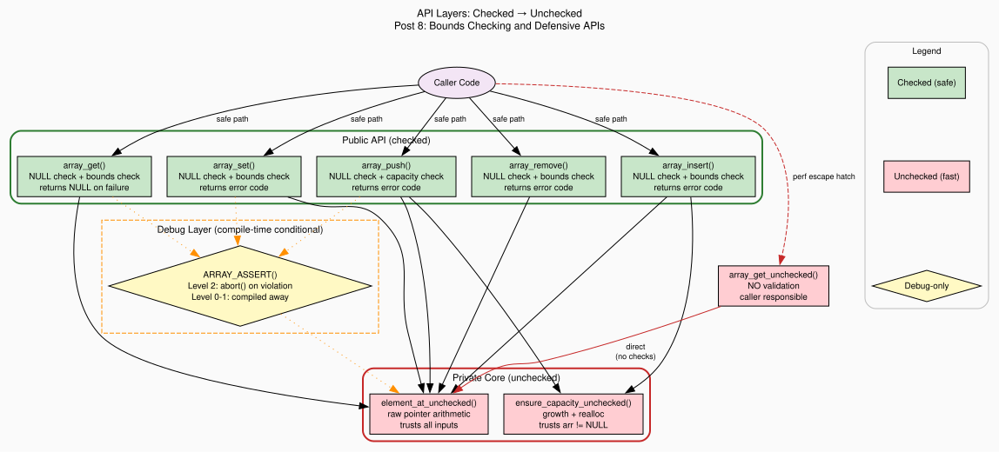

+++
title = "Bounds Checking and Defensive APIs"
author = ["pablo"]
date = 2026-07-01
draft = true
translationKey = "post-08-bounds-checking"
series = ["Dynamic Arrays in C"]
seriesPost = 8
tags = ["c", "dynamic-array", "bounds-checking", "assert", "defensive-programming", "api-contracts", "ndebug", "preprocessor", "data-structures"]
description = "Implement configurable bounds checking in C with assert in debug builds and error codes in release. Learn the #ifdef pattern, API contracts, and checked vs unchecked accessors."
slug = "bounds-checking-defensive-api-assert-ndebug-c"
+++

*Post 8 of the Dynamic Arrays in C series · [Full source code on GitHub](https://github.com/ansuzgs/dynamic-arrays-c/blob/main/src/post_08.c)*


## Trust Is a Spectrum

Our array has grown into a capable data structure. It stores any type, grows on demand, handles errors without corrupting state, sorts itself with user-provided comparators, and cleans up owned resources through destructors. But every function we've written shares a quiet assumption: the caller will pass valid arguments. A valid pointer. A valid index. An element that actually matches the stored type's size.

Sometimes that assumption holds. Application code written by the same person who wrote the library tends to get the arguments right, the shared mental model prevents most mistakes. But library code lives in a different world. It's called by people who didn't write it, who haven't read the source, who are moving fast and making assumptions of their own. The moment your code crosses that boundary, from "my private helper" to "someone else's API", the question of trust becomes a design problem.

The C language has a traditional answer: trust the caller completely. The standard library's [`memcpy`](https://en.cppreference.com/w/c/string/byte/memcpy) doesn't check whether `src` and `dst` overlap (that's [`memmove`](https://en.cppreference.com/w/c/string/byte/memmove)'s job). `strlen` doesn't check for NULL (that's your job). `printf` doesn't verify that your format specifiers match your arguments (that's a bug you'll find at 3 AM). This approach has a name: *undefined behavior on contract violation*. The function documents what the caller must guarantee, and if the caller violates those guarantees, anything can happen, silently correct results, garbage data, a segfault three functions later, or a security vulnerability that ships to production.

The opposite extreme is to check everything, always. Every pointer for NULL, every index against bounds, every size for overflow. This is safe, your function never reads memory it shouldn't, but it comes with costs that compound. Each check is a conditional branch. The branch is predictable (the happy path is taken 99.99% of the time), but the comparison still consumes an instruction issue slot, pollutes the [branch predictor](https://en.wikipedia.org/wiki/Branch_predictor)'s state, and, in tight inner loops, prevents certain optimizations the compiler could otherwise perform. For a function called once per frame in a GUI application, the cost is immeasurable. For a function called once per element in a sort comparator, it's measurable and real.

Between these extremes lies the approach most production C libraries actually use: *configurable checking*. The same source code, compiled with different flags, produces different behavior. In debug builds (where performance doesn't matter and correctness matters enormously), every precondition is validated with an assertion that crashes the program immediately on violation, loud, obvious, impossible to ignore. In release builds (where performance matters and bugs should have been caught already), the assertions are compiled away to nothing, leaving zero overhead. And in the default build (no flags specified), runtime checks return error codes, not as fast as unchecked, not as loud as assertions, but safe everywhere.

This is the `#ifdef` pattern, and it's how [`assert()`](https://en.cppreference.com/w/c/error/assert) itself works in standard C. This post applies that pattern to our array's API, introduces the concept of API contracts and preconditions, adds both checked and unchecked accessors, and documents every function's obligations clearly enough that a caller who reads the header knows exactly what they're responsible for.

The design philosophy is "safe by default, fast by opt-in." A caller who does nothing special gets runtime bounds checking on every access. A caller who needs maximum performance can use the unchecked variants after proving their indices are valid. A developer debugging a crash can recompile with assertions and get an immediate backtrace at the exact point of the violation. Same code, three behaviors, controlled entirely by compiler flags.


## The Code

The full file compiles with zero warnings under `gcc -Wall -Wextra -std=c11` in all three build modes (default, `-DARRAY_DEBUG_CHECKS`, `-DNDEBUG`), runs five demonstrations (checked vs unchecked access, build mode behavior, error callback monitoring, performance loop patterns, and API contract documentation), and generates both ASCII visualization and a Graphviz DOT file.

> The complete source, all five demos, the three-level checking system, the unchecked accessors, and the DOT generator, is available [on GitHub](https://github.com/ansuzgs/dynamic-arrays-c/blob/main/src/post_08.c).

### The Build Mode Machinery

The foundation is four lines of preprocessor logic that define the behavior of `ARRAY_ASSERT` and `ARRAY_BOUNDS_CHECK_ENABLED`:

```c
#ifdef NDEBUG
  /* Level 0: trust the caller. No debug checks at all. */
  #define ARRAY_ASSERT(cond, msg) ((void)0)
  #define ARRAY_BOUNDS_CHECK_ENABLED 0
#elif defined(ARRAY_DEBUG_CHECKS)
  /* Level 2: crash immediately on contract violation. */
  #define ARRAY_ASSERT(cond, msg) \
      do { \
          if (!(cond)) { \
              fprintf(stderr, "ARRAY ASSERTION FAILED: %s\n  %s:%d\n", \
                      (msg), __FILE__, __LINE__); \
              abort(); \
          } \
      } while (0)
  #define ARRAY_BOUNDS_CHECK_ENABLED 1
#else
  /* Level 1: default. Runtime checks return errors. No asserts. */
  #define ARRAY_ASSERT(cond, msg) ((void)0)
  #define ARRAY_BOUNDS_CHECK_ENABLED 1
#endif
```

[`NDEBUG`](https://en.cppreference.com/w/c/error/assert) is the standard C macro, it's what `<assert.h>` checks. We piggyback on it because it's the convention every C developer already knows. When the user compiles with `-DNDEBUG`, they're explicitly saying "I trust my code, give me maximum performance." We respect that.

`ARRAY_DEBUG_CHECKS` is our library-specific macro for maximum paranoia. When defined, every public function asserts its preconditions before checking them, if you pass an invalid index, the program [aborts](https://en.cppreference.com/w/c/program/abort) immediately with the file, line, and a description of what went wrong. You never see a mysterious "NULL returned" three calls later; you see the exact violation site.

The default (neither flag) is the safe middle ground: no asserts, but runtime checks return error codes. The caller can check them or ignore them, the array's state is protected either way.

### The Two-Layer Architecture

Every public function follows the same three-step structure:

```c
void *array_get(const Array *arr, size_t index)
{
    /* Step 1: ASSERT preconditions (debug builds only) */
    ARRAY_ASSERT(arr != NULL, "array_get: arr must not be NULL");
    ARRAY_ASSERT(index < arr->size, "array_get: index out of bounds");

    /* Step 2: VALIDATE preconditions (all builds with checks enabled) */
    if (!arr || index >= arr->size) {
        return NULL;
    }

    /* Step 3: delegate to the unchecked internal function */
    return element_at_unchecked(arr, index);
}
```

Step 1 fires in debug builds and catches bugs at the site of the violation, the debugger stops right here, not in some downstream function that received a garbage pointer. Step 2 provides safety in default builds, returning a clean error instead of reading out-of-bounds memory. Step 3 calls the internal function, which performs raw pointer arithmetic without any validation.

The internal functions are named with the `_unchecked` suffix, a deliberate signal. In a code review, seeing `element_at_unchecked(arr, index)` without preceding validation is an immediate red flag. The naming convention serves as documentation: "if you're calling me directly, you'd better know what you're doing."

```c
/* Returns a pointer to the element at `index`. No bounds check. */
static void *element_at_unchecked(const Array *arr, size_t index)
{
    return (char *)arr->data + index * arr->element_size;
}
```

This function is `static`, invisible outside the compilation unit. Only the public API calls it, and only after validation. The caller never gets direct access.

### The Escape Hatch: array_get_unchecked

Sometimes the caller *has* already validated the index. The most common case is a simple iteration loop:

```c
for (size_t i = 0; i < array_size(arr); i++) {
    int *p = array_get_unchecked(arr, i);  /* safe: i < size */
    total += *p;
}
```

The loop bounds guarantee `i < size`. Calling `array_get` (checked) inside this loop would validate `i < arr->size` on every iteration, a condition that's provably true from the loop structure. It's redundant work. For 10 iterations, it's negligible. For 10 million, it's measurable.

`array_get_unchecked` provides zero-overhead access for exactly this case:

```c
void *array_get_unchecked(const Array *arr, size_t index)
{
    return element_at_unchecked(arr, index);
}
```

No NULL check. No bounds check. One pointer arithmetic operation. The caller is 100% responsible for ensuring `arr != NULL` and `index < arr->size`. If they get it wrong, it's [undefined behavior](https://en.wikipedia.org/wiki/Undefined_behavior), the same consequences as a raw buffer overread. This function exists because the C tradition of caller responsibility isn't wrong, it's just not the right *default*.

The type-safe macro wraps it cleanly:

```c
#define ARRAY_GET_UNCHECKED(arr, type, index) \
    ( (type *)array_get_unchecked((arr), (index)) )
```

<!-- 📸 INSERT IMAGE HERE: Render the Graphviz DOT file (`outputs/post_08_api_layers.svg`) and insert it here. The diagram shows the two-layer architecture: Caller → Public Checked API (green boxes: array_get, array_set, array_push, etc.) → Private Unchecked Core (red boxes: element_at_unchecked, ensure_capacity_unchecked), with the escape hatch (array_get_unchecked) bypassing the public layer directly to the private core. The debug assert layer (yellow diamond) sits between public and private, active only in ARRAY_DEBUG_CHECKS mode. -->


### The New Error Code

We add one new error code to the existing enum:

```c
ARRAY_ERR_CONTRACT = -7   /* API contract violation */
```

This distinguishes contract violations (calling `array_create` with `element_size == 0`) from operational failures (allocation ran out of memory). The distinction matters for logging: a contract violation is a bug in the caller's code; an allocation failure is an environmental condition. You fix the first by fixing code; you handle the second with fallback logic.

### The Visualization: Valid vs Invalid Regions

The ASCII visualization for this post marks three distinct regions of the array's memory:

<pre style="width: fit-content; margin: 0 auto;">
╔══════════════════════════════════════════════════════════╗
║  5 elements in capacity-8 array                          ║
╠══════════════════════════════════════════════════════════╣
║  type: int       element_size: 4     reallocs: 0         ║
║  size: 5         capacity: 8                             ║
║  build mode: DEFAULT (runtime checks)                    ║
╠══════════════════════════════════════════════════════════╣
║  Legend: ✓ = valid  · = allocated/unused  ✗ = OOB       ║
╠══════════════════════════════════════════════════════════╣
║  ✓ [ 0] +0     │ 100                                     ║
║  ✓ [ 1] +4     │ 200                                     ║
║  ✓ [ 2] +8     │ 300                                     ║
║  ✓ [ 3] +12    │ 400                                     ║
║  ✓ [ 4] +16    │ 500                                     ║
║  · [ 5] +20    │ (unused)                                ║
║  · [ 6] +24    │ (unused)                                ║
║  · [ 7] +28    │ (unused)                                ║
║  ✗ [ 8] +32    │ OUT OF BOUNDS, undefined behavior       ║
║  ✗ [ 9] +36    │ OUT OF BOUNDS, undefined behavior       ║
╠══════════════════════════════════════════════════════════╣
║  20B used / 32B allocated = 62.5% utilization            ║
╠══════════════════════════════════════════════════════════╣
║  array_get(arr, 4)       → valid (last element)          ║
║  array_get(arr, 5)       → NULL (out of bounds)          ║
║  array_get_unchecked(arr, 5) → UNDEFINED BEHAVIOR!       ║
╚══════════════════════════════════════════════════════════╝
</pre>

The ✓/·/✗ markers make the three zones visually distinct. `array_get` at index 4 returns the last valid element. `array_get` at index 5 returns NULL, the bounds check caught it. `array_get_unchecked` at index 5 would perform the pointer arithmetic and return whatever bytes happen to sit in that allocated-but-uninitialized memory, or worse, memory past the allocation entirely. The visualization also reports the current build mode, so the reader knows which checking level produced the output.


## Concepts and Tradeoffs

### Always-On Checks vs Debug-Only Asserts vs Unchecked

This is the central design decision of the post, and every C library makes it differently.

Always-on runtime checks (our Level 1 default) guarantee that no function ever reads or writes out-of-bounds memory, regardless of build mode. The cost is one or two comparisons per call, a branch that the CPU's predictor will get right 99.99% of the time, costing roughly a nanosecond per call on modern hardware. For a library used in applications (GUIs, web servers, batch processing), this is the right default. The safety is measurable; the overhead isn't.

Debug-only asserts (our Level 2, also how `<assert.h>` works) are for catching bugs during development. They crash the program immediately on a violation, producing an error message with the exact file and line. This is more useful than returning an error code because an error code can be silently ignored, `array_get(arr, 999)` returns NULL, the caller doesn't check, and the NULL propagates until it causes a crash somewhere else. An assert prevents that propagation: the bug is caught at the violation site, not three stack frames later. But asserts that crash production code are unacceptable for library code, the library doesn't get to decide that the whole program should die.

Unchecked access (our `array_get_unchecked`, also the C standard library's approach) provides zero overhead. The caller guarantees correctness; the function trusts that guarantee. This is the right choice for inner loops where the indices are provably valid, and the wrong choice for everything else. The naming convention (`_unchecked`) serves as a permanent warning: this function offers power, not safety.

Our three-level system combines all three through the preprocessor. The same source file produces three different binaries from three different compiler invocations. No `#ifdef` clutter inside business logic, the policy is defined once, at the top of the file, and every function uses the same macros.

### Design by Contract: Preconditions, Postconditions, Errors

Every function in a well-designed API has a contract, a precise description of what the caller must guarantee (preconditions), what the function guarantees in return (postconditions), and what can go wrong (error conditions). This idea was formalized by [Bertrand Meyer](https://en.wikipedia.org/wiki/Bertrand_Meyer) in 1986 as ["Design by Contract"](https://en.wikipedia.org/wiki/Design_by_contract) and is built into the [Eiffel programming language](https://en.wikipedia.org/wiki/Eiffel_(programming_language)) as a first-class feature. C has no language support for contracts, but the concept applies perfectly as documentation and code discipline.

For `array_get`, the contract is:

- **Preconditions:** `arr` must not be NULL; `index` must be less than `arr->size`.
- **Postconditions:** Returns a pointer to the element at `index`. The array's state is unchanged.
- **On violation:** Returns NULL (checked) or undefined behavior (unchecked).

Writing contracts forces you to think about edge cases before they happen. What if `arr` is NULL? What if `index` equals `size`? What if `element` points to fewer bytes than `element_size`? The answers go into the documentation, not into the code as ad-hoc special cases.

### The Naming Convention as Safety Signal

The `_unchecked` suffix is more than a naming convention, it's a social contract with every developer who will ever read or maintain this code. When you see `element_at_unchecked` in a function body, you expect to find validation code *above* it. When you see `array_get_unchecked` in calling code, you expect the caller to have proven their index is valid. The absence of the suffix means the function validates its inputs, the checked path is the default, and opting out requires an explicit, visible choice.

This pattern appears throughout systems programming: Rust has `unwrap()` (checked, panics) vs [`unwrap_unchecked()`](https://doc.rust-lang.org/std/option/enum.Option.html#method.unwrap_unchecked) (unchecked, UB); C++ has [`at()`](https://en.cppreference.com/w/cpp/container/vector/at

) (checked, throws) vs `operator[]` (unchecked in most implementations); even Java has `Optional.get()` (checked, throws) vs direct field access. The pattern is universal because the tradeoff is universal.


## Try This and Watch It Break

**Experiment 1: Debug Mode Crash.** Recompile with `gcc -DARRAY_DEBUG_CHECKS -g -o post_08 post_08.c`. The program will abort during Demo 3 (error callback), because the first out-of-bounds `array_set` triggers `ARRAY_ASSERT` before the runtime check can return an error code. The assert message shows the exact file and line. This is the intended behavior, in debug mode, contract violations are bugs, not recoverable errors.

**Experiment 2: Release Mode Behavior.** Compile with `gcc -DNDEBUG -O2 -o post_08 post_08.c`. Run it. The output is identical to the default build for this demo because our public functions still have runtime checks even in release mode. To see the difference, modify `array_get` to guard its runtime check behind `#if ARRAY_BOUNDS_CHECK_ENABLED`. Now, in release mode, `array_get` skips the bounds check entirely, and returns whatever memory happens to be at that offset.

**Experiment 3: Remove the Runtime Check.** In `array_push`, comment out the `if (!arr || !element)` block. Compile with default flags. Call `array_push(NULL, &val)`. Without the check, the function dereferences NULL on the `ensure_capacity_unchecked` call, instant segfault. The runtime check costs two pointer comparisons; the segfault costs a debugging session.

**Experiment 4: Benchmark the Cost.** Write a loop that calls `array_get` one million times on a 1000-element array. Time it with checked access, then with `array_get_unchecked`. The difference is the cost of bounds checking in a hot loop. On modern x86, expect 1-3 nanoseconds per call, negligible for 1000 calls, measurable for 100 million.


## Knowledge Test

> **Design an `array_get()` that is safe in debug builds and zero-overhead in release. Show the `#ifdef` pattern.**

```c
void *array_get(const Array *arr, size_t index)
{
    /* Debug: crash immediately on violation */
    ARRAY_ASSERT(arr != NULL, "NULL array");
    ARRAY_ASSERT(index < arr->size, "index out of bounds");

    /* Default/Release: compile-time conditional */
    #if ARRAY_BOUNDS_CHECK_ENABLED
        if (!arr || index >= arr->size)
            return NULL;
    #endif

    return element_at_unchecked(arr, index);
}
```

In debug mode (`ARRAY_DEBUG_CHECKS`): the asserts fire and abort the program before the runtime check even runs. The developer sees the exact violation with file and line number.

In default mode (no flags): the asserts are no-ops, but `ARRAY_BOUNDS_CHECK_ENABLED` is 1, so the runtime check returns NULL on invalid access. Safe, with the cost of two comparisons.

In release mode (`NDEBUG`): both the asserts and the runtime check are compiled away. The function is equivalent to `return (char *)arr->data + index * arr->element_size`, pure pointer arithmetic, zero branches. The caller is entirely responsible for valid arguments.

The tradeoff is explicit and visible: release mode trades safety for performance. If a bug survives past debug and default testing, it reaches release as undefined behavior rather than a clean error. The mitigation is to test thoroughly in debug mode, where asserts catch violations loudly.


## What's Next

We have a defensive API with configurable checking, documented contracts, and a clean separation between the safe public layer and the fast private core. The array catches bugs loudly in debug builds, handles them gracefully in default builds, and gets out of the way in release builds.

But accessing elements one at a time, even with unchecked access, has a fundamental limitation. The caller has to manage loop indices, cast pointers, and track the array's size manually. Languages with iterators (C++, Rust, Python) let you write `for (auto &x : arr)` and forget about indices entirely.

In **Post 9: "Iterators and Bulk Operations: Insert, Remove, Slice"**, we add operations that work on ranges of elements rather than individual indices. `array_insert_range` inserts multiple elements at once. `array_remove_range` removes a contiguous span. `array_copy_range` extracts a slice into a new array. These operations reduce the number of function calls (and bounds checks) for batch work, and they set up the patterns we'll need for more advanced iteration in later posts.


*[Full source code on GitHub](https://github.com/ansuzgs/dynamic-arrays-c/blob/main/src/post_08.c)*
<!-- · Compile: `gcc -Wall -Wextra -std=c11 -o post_08 post_08.c` · Previous: [Function Pointers and Callbacks](07_function_pointers.md) · Next: [Iterators and Bulk Operations](09_iterators.md)* -->
