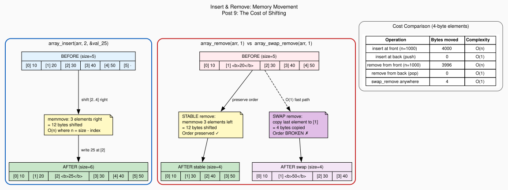

+++
title = "Insert, Remove, and the Cost of Shifting"
author = ["pablo"]
date = 2026-07-17
draft = false
translationKey = "post-09-insert-remove-shifting"
series = ["Dynamic Arrays in C"]
seriesPost = 9
tags = ["c", "dynamic-array", "memmove", "insert", "remove", "swap-remove", "big-o", "index-stability", "data-structures"]
description = "Implement insert and remove with memmove in a C dynamic array, measure the O(n) shifting cost in bytes, and build a constant-time swap-remove for unordered data."
slug = "insert-remove-memmove-swap-remove-dynamic-array-c"
+++

*Post 9 of the Dynamic Arrays in C series · [Full source code on GitHub](https://github.com/ansuzgs/dynamic-arrays-c/blob/main/src/post_09.c)*

## The Price of Contiguous Memory

Dynamic arrays earn their performance from a single property: contiguous memory. Every element sits next to its neighbor in a flat, uninterrupted buffer. The CPU's cache prefetcher loves this, when you read element 0, elements 1 through 15 are already on their way into L1. Sequential iteration runs at memory bandwidth, not memory latency. This is why arrays outperform linked lists for traversal even though linked lists have O(1) insertion: the constant factor hidden inside big-O notation is dominated by cache behavior, and contiguous beats scattered by an order of magnitude on modern hardware.

But contiguous memory has a cost, and that cost shows up the moment you try to insert or remove an element anywhere other than the end.

Consider an array of five elements: `[10, 20, 30, 40, 50]`. You want to insert the value 25 at index 2, between 20 and 30. In a linked list, you'd allocate a new node, adjust two pointers, and you're done, the existing nodes don't move. In a contiguous array, there's no gap between 20 and 30. The bytes that hold 30 are immediately adjacent to the bytes that hold 20. To make room for 25, you have to physically move 30, 40, and 50 one position to the right: copy 12 bytes (three 4-byte integers) to make a 4-byte gap, then write 25 into the gap. The array preserves its contiguous layout, but you paid for it by shifting three elements.

Removal is the same story in reverse. Removing the element at index 1 (value 20) from `[10, 20, 30, 40, 50]` leaves a gap between 10 and 30. To maintain contiguity, you shift 30, 40, and 50 one position to the left: 12 bytes of movement to close a 4-byte gap. The result is `[10, 30, 40, 50]`, contiguous again, but at the cost of moving everything after the deletion point.

The cost scales linearly. Inserting at the front of a 1,000-element array shifts all 1,000 elements. Inserting at the back shifts zero, that's just a push. The average case (random position) shifts n/2 elements. For a 4-byte element type, removing from the front of a 10,000-element array moves 39,996 bytes. That's not a theoretical concern, it's a `memmove` call that the CPU actually executes, touching every cache line the array occupies.

This is the fundamental tradeoff of the array data structure. You get O(1) random access and cache-friendly iteration, but you pay O(n) for mid-array insertion and removal. Every production array library, C++'s `std::vector`, Rust's `Vec`, Python's `list`, Java's `ArrayList`, makes this same tradeoff and documents the same warning: "insertion and removal at positions other than the end are linear."

But there's a trick. If you don't care about the order of elements, and surprisingly often, you don't, you can remove any element in O(1). Instead of shifting everything left to fill the gap, you copy the last element into the gap and decrement the size. One `memcpy` of `element_size` bytes, regardless of array size. The element is gone, the array is still contiguous, and the cost is constant. The price: the relative order of elements changes. The element that was last is now in the middle. This technique is called *swap-remove* (or *unstable remove*), and it's standard in game engines, particle systems, and entity-component architectures where order is irrelevant and removal performance is critical.

This post implements both strategies, measures their cost in bytes shifted, and examines the subtle problem of index stability, what happens to external references when elements move.


## The Code

The full file compiles with zero warnings under `gcc -Wall -Wextra -std=c11`, runs four demonstrations (insertion at various positions, stable vs swap-remove, scaling cost comparison, and index stability analysis), and generates both ASCII visualization and a Graphviz DOT file.

> The complete source, all four demos, the swap-remove implementation, the step-by-step shift visualization, and the DOT generator, is available [on GitHub](https://github.com/ansuzgs/dynamic-arrays-c/blob/main/src/post_09.c).

### Tracking the Cost

The first change to the struct is a new counter:

```c
typedef struct {
    void          *data;
    size_t         size;
    size_t         capacity;
    size_t         element_size;
    size_t         realloc_count;
    size_t         bytes_shifted;     /* NEW: cumulative memmove cost */
    ArrayDestroyFn destroy_fn;
} Array;
```

`bytes_shifted` accumulates the total number of bytes moved by `memmove` across all insert and remove operations on this array. It's a diagnostic field, production code might not keep it, but it makes the O(n) cost concrete and measurable. When a demo shows "bytes shifted: 39,996", that's not an estimate; it's the actual number of bytes the CPU copied.

### Insert: The Mechanics

The insert function hasn't changed since [Post 6](../post-06-error-handling), but this post is where we examine it under a microscope:

```c
ArrayError array_insert(Array *arr, size_t index, const void *element)
{
    /* ... validation omitted for clarity ... */

    /* Step 1: ensure capacity, BEFORE any shifting */
    ArrayError err = ensure_capacity_unchecked(arr, arr->size + 1);
    if (err != ARRAY_OK) return err;

    /* Step 2: shift elements right to open a gap */
    if (index < arr->size) {
        void *dst = element_at_unchecked(arr, index + 1);
        void *src = element_at_unchecked(arr, index);
        size_t bytes = (arr->size - index) * arr->element_size;
        memmove(dst, src, bytes);
        arr->bytes_shifted += bytes;
    }

    /* Step 3: copy the new element into the gap */
    memcpy(element_at_unchecked(arr, index), element, arr->element_size);
    arr->size++;

    return ARRAY_OK;
}
```

Three details matter. First, capacity is ensured *before* the shift. If we shifted first and then the realloc failed, we'd have a gap in the middle of the array with no element to fill it, the array's state would be corrupted. By ensuring capacity first, we know the shift will succeed, and we know the write will succeed, so the operation is atomic from the caller's perspective.

Second, the shift uses `memmove`, not `memcpy`. When inserting at index 2 in a 5-element array, the source region is bytes `[8..19]` (indices 2-4) and the destination is `[12..23]` (indices 3-5). These regions overlap at bytes `[12..19]`. `memcpy`'s behavior with overlapping regions is undefined, it might copy left-to-right and overwrite `[12..15]` with `[8..11]` before reading the original `[12..15]`. `memmove` detects the overlap and copies in the correct direction (right-to-left in this case), guaranteeing a correct result.

Third, the cost is `(size - index) * element_size` bytes. Inserting at the front (index 0) shifts all `size` elements, the worst case. Inserting at the end (index == size) shifts zero elements, this degenerates to `array_push`, the best case. The average is `size/2` elements shifted per insert.

### Remove: The Mirror Image

Stable removal shifts elements left instead of right:

```c
ArrayError array_remove(Array *arr, size_t index)
{
    /* ... validation omitted ... */

    /* Step 1: destroy the element being removed */
    if (arr->destroy_fn) {
        arr->destroy_fn(element_at_unchecked(arr, index));
    }

    /* Step 2: shift elements left to fill the gap */
    if (index < arr->size - 1) {
        void *dst = element_at_unchecked(arr, index);
        void *src = element_at_unchecked(arr, index + 1);
        size_t bytes = (arr->size - index - 1) * arr->element_size;
        memmove(dst, src, bytes);
        arr->bytes_shifted += bytes;
    }

    /* Step 3: decrement size */
    arr->size--;
    return ARRAY_OK;
}
```

The destructor is called *before* the shift. This ordering is critical: the shift overwrites the removed element's memory with its right neighbor's data. If we shifted first, the element's memory would already be overwritten before the destructor could clean it up. For types that don't own resources (ints, floats, simple structs), the destructor is NULL and the ordering doesn't matter. For types that own heap allocations (strings stored as `char*`), calling the destructor after the shift would try to free a pointer that's already been overwritten, a use-after-free or double-free bug.

The cost is `(size - index - 1) * element_size` bytes, one fewer than insert because the removed element doesn't need to be moved. Removing the last element shifts zero bytes (a pop), and removing the first element shifts `(size - 1) * element_size` bytes.

### Swap-Remove: The O(1) Alternative

This is the new function:

```c
ArrayError array_swap_remove(Array *arr, size_t index)
{
    /* ... validation omitted ... */

    /* Step 1: destroy the element being removed */
    if (arr->destroy_fn) {
        arr->destroy_fn(element_at_unchecked(arr, index));
    }

    /* Step 2: if not removing the last element, overwrite with last */
    if (index < arr->size - 1) {
        void *dst = element_at_unchecked(arr, index);
        void *src = element_at_unchecked(arr, arr->size - 1);
        memcpy(dst, src, arr->element_size);
    }

    /* Step 3: decrement size */
    arr->size--;
    return ARRAY_OK;
}
```

Instead of shifting n elements left, swap-remove copies exactly one element: the last element in the array, placed into the position being removed. The cost is always `element_size` bytes, 4 bytes for an int, 8 for a double, whatever the element size is, regardless of the array's length or the removal position. For a 10,000-element array of ints, removing index 0 with stable remove moves 39,996 bytes; swap-remove moves 4 bytes. That's a 9,999× difference.

Note that swap-remove uses `memcpy`, not `memmove`. The source (last element) and destination (removed element's position) never overlap, they're at opposite ends of the used region, so the cheaper `memcpy` is safe.

<!-- IMAGE PLACEMENT: Insert the Graphviz-generated diagram here (outputs/post_09_shift_layout.svg). The diagram shows a side-by-side comparison of the insert operation (before → shift → after) and the two removal strategies (stable remove vs swap-remove), with byte counts for each path. Place it after this paragraph, before the "Concepts and Tradeoffs" section. Caption suggestion: "Figure 1: Memory movement during insert and remove. Stable removal shifts all elements after the gap; swap-remove copies only the last element." -->


## Concepts and Tradeoffs

### memmove vs memcpy: When Overlap Matters

`memcpy` and `memmove` both copy `n` bytes from source to destination. The difference is a single guarantee: `memmove` handles overlapping regions correctly, `memcpy` doesn't promise to.

In practice, on most modern implementations, `memmove` checks whether the regions overlap and, if they don't, delegates to the same optimized copy loop that `memcpy` uses. The overhead of the overlap check is a single pointer comparison, negligible. But the standard doesn't require this, so using `memcpy` on overlapping regions is undefined behavior even if it happens to work on your platform today.

The rule is simple: if source and destination *could* overlap, use `memmove`. In our array, insertion shifts elements right (destination is *after* source, they overlap) and removal shifts elements left (destination is *before* source, they overlap). Both require `memmove`. Swap-remove copies from the last element to a non-adjacent position, no overlap possible, so `memcpy` is correct.

### Stable vs Unstable: Order as a Requirement

The choice between stable remove and swap-remove is not a performance decision, it's a *correctness* decision. The question is: "Does the order of elements in this array carry meaning?"

If the array is sorted, order is the whole point. Swap-remove would destroy the sort invariant, requiring a re-sort (O(n log n)) that's far worse than the O(n) shift you were trying to avoid. If the array represents a queue, a timeline, or a UI list where the user sees element positions, order matters and stable remove is the only correct choice.

If the array is a bag of game entities, a pool of reusable objects, or a collection where elements are identified by content rather than position, order is meaningless overhead. Swap-remove is faster by a factor proportional to the array size.

Many real codebases use both strategies on the same array type, exposing them as separate functions and letting the caller choose per-call. That's the approach we take: `array_remove` for stable removal, `array_swap_remove` for constant-time removal.

### Index Stability: A Subtlety That Bites

Neither removal strategy preserves index stability, the property that an element's index doesn't change after modifications to the array.

Consider `[10, 20, 30, 40, 50]` with an external reference: "element 40 is at index 3." After `array_remove(arr, 1)` (removing 20), the array is `[10, 30, 40, 50]`. Element 40 is now at index 2, but our reference still says 3, it now points to 50.

After `array_swap_remove(arr, 1)` (removing 20), the array is `[10, 50, 30, 40]`. Element 40 is still at index 3. The swap-remove happened to preserve our reference because the removal was *before* the referenced element, but that's coincidence, not a guarantee.

If your design requires stable handles to array elements, a dynamic array is the wrong data structure. You need a slot map (array of values plus an indirection table), a generational index system (each slot has a generation counter that invalidates stale references), or, if you can tolerate the cache cost, a linked list or hash map.

### The Cost Table

For a 4-byte element type, here's what each operation costs in bytes moved:

| Operation | Best case | Worst case | Average |
|---|---|---|---|
| Insert at index `i` (size = n) | 0 (push) | 4n | 2n |
| Stable remove at index `i` | 0 (pop) | 4(n-1) | 2(n-1) |
| Swap-remove at any index | 4 | 4 | 4 |

The push and pop (insert/remove at the end) are already O(1), they're the operations we've been using since [Post 2](../post-02-growing-pain). The new insight is that *all* removal can be O(1) if order doesn't matter.


## Try This and Watch It Break

**Experiment 1: Use memcpy Instead of memmove.** In `array_insert`, replace `memmove(dst, src, bytes)` with `memcpy(dst, src, bytes)`. Build a small array `[10, 20, 30, 40, 50]` and insert at index 0. On some platforms, you'll see duplicated elements (because `memcpy` copied left-to-right, overwriting source data before reading it). On others, it'll appear to work, that's the treachery of undefined behavior. Compile with `-fsanitize=undefined` to see if your sanitizer catches it.

**Experiment 2: Swap the Capacity Check Order.** In `array_insert`, move the `memmove` call *before* `ensure_capacity_unchecked`. Fill an array to capacity, then insert at index 0. The shift will write past the end of the allocated buffer, a heap buffer overflow. Compile with `-fsanitize=address` to watch AddressSanitizer catch it.

**Experiment 3: Iterate Forward and Swap-Remove.** Write a loop that iterates from index 0 to size, calling `array_swap_remove` on every element that matches a condition. The loop will skip elements: when you swap-remove index `i`, the element formerly at the end is now at index `i`, but the loop increments to `i+1` and never examines it. Fix it by iterating backward, or by not incrementing `i` when a swap-remove happens.

**Experiment 4: Measure the Crossover.** Write a benchmark that removes the middle element from arrays of size 10, 100, 1000, and 10000, comparing stable remove vs swap-remove. The stable remove time grows linearly; the swap-remove time stays flat. Find the array size where the difference becomes measurable on your hardware (hint: it's smaller than you think, `memmove` is fast, but cache line eviction is real).


## Knowledge Test

> **You have an array of 1000 int elements and need to remove element at index 500. Compare the cost of memmove vs swap-remove.**

Stable remove (memmove): elements 501 through 999 shift one position left. That's 499 elements × 4 bytes = 1,996 bytes moved. The complexity is O(n), where n is the number of elements after the removal point.

Swap-remove (memcpy): copy element 999 into position 500. That's 1 element × 4 bytes = 4 bytes moved. The complexity is O(1).

The stable remove does 499× more work. For element 0, it would be 999× more work. For element 999 (the last element), both do zero work, just decrement the size.

The tradeoff: after swap-removing index 500, the element that was at index 999 is now at index 500. If the array was sorted, it isn't anymore. If external code stored index 999 as a reference, that reference now points past the end of the array.


## What's Next

We can now insert and remove elements at any position, with a clear understanding of the cost. Stable operations preserve order at O(n) expense; swap-remove trades order for O(1) constant-time removal. The `bytes_shifted` counter makes the cost concrete rather than theoretical.

But working with individual elements, insert one, remove one, get one, forces the caller to manage loop indices, track sizes, and handle the mechanics of traversal manually. When you want to process every element in the array, you write a `for` loop with an index variable, a size check, and a cast. When you want to remove elements *during* traversal, the interaction between the loop counter and the shifting logic gets subtle and error-prone.

In **Post 10: "Iterators and Traversal Patterns in C"**, we build a lightweight iterator abstraction that encapsulates traversal state, handles the index arithmetic internally, and introduces the concept of iterator invalidation, what happens to an in-progress traversal when `push`, `insert`, or `remove` modifies the array underneath it.


*[Full source code on GitHub](https://github.com/ansuzgs/dynamic-arrays-c/blob/main/src/post_09.c)*
