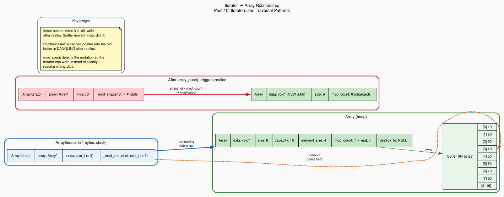

+++
title = "Iterators and Traversal Patterns in C"
author = ["pablo"]
date = 2026-07-24
draft = true
translationKey = "post-10-iterators-traversal"
series = ["Dynamic Arrays in C"]
seriesPost = 10
tags = ["c", "dynamic-array", "iterators", "traversal", "iterator-invalidation", "predicate-callbacks", "modification-counter", "data-structures"]
description = "Build a lightweight index-based iterator in C with begin/next/valid semantics, filtered traversal, and fail-fast invalidation detection via a modification counter."
slug = "iterators-traversal-patterns-c"
+++

*Post 10 of the Dynamic Arrays in C series · [Full source code on GitHub](https://github.com/ansuzgs/dynamic-arrays-c/blob/main/src/post_10.c)*

## The Loop You Write a Hundred Times

Every program that uses an array eventually writes the same loop. Create an index variable. Check it against the size. Access the element. Increment. Repeat. For our dynamic array, that loop looks like this:

```c
for (size_t i = 0; i < array_size(arr); i++) {
    int *val = (int *)array_get(arr, i);
    process(*val);
}
```

Five lines, two function calls per iteration, and a cast. It works. It has worked since K&R. And it has three problems that compound as codebases grow.

The first problem is ceremony. Every traversal repeats the same boilerplate: declare `i`, compare against `array_size`, call `array_get`, cast the `void*` result. The cast is especially painful, it's a type-unsafe operation that the compiler can't verify, repeated at every access site. If you change the array's element type from `int` to `double`, the compiler won't warn you that your casts are now wrong. The bug shows up at runtime, or worse, never, because the wrong-sized read happens to produce plausible values.

The second problem is coupling. The loop body knows that the array uses zero-based indexing, that `array_get` returns `void*`, that size is checked by comparison. If you later replace the array with a different container, a linked list, a hash map, a ring buffer, every loop that traverses it must be rewritten. The traversal logic is fused to the data structure's internal representation.

The third problem, and the one that actually causes bugs, is mutation during traversal. Consider removing all even numbers from an array by iterating forward and calling `array_remove` when you find one. When you remove element at index `i`, every element after it shifts left by one position. The element that was at index `i+1` is now at index `i`. But your loop increments `i` to `i+1`, skipping the element that just shifted into position `i`. If two even numbers are adjacent, say 8 and 14, the loop removes 8, shifts 14 into 8's position, increments past it, and 14 survives the removal pass. This is not a theoretical concern; it's one of the most common bugs in C code that modifies collections during iteration.

Languages with iterators solve these problems by abstracting traversal into an object. C++ has `begin()`/`end()` with pointer-like operators. Rust has `Iterator` with `next()` returning `Option<T>`. Python has `__iter__`/`__next__` with `StopIteration`. Java has `Iterator<E>` with `hasNext()`/`next()` and a `ConcurrentModificationException` for mutation during iteration.

C has none of these built-in. But C has structs, function pointers, and macros, and that's enough to build a lightweight iterator that captures the same semantics. Our iterator won't match C++'s generality or Rust's zero-cost abstractions, but it will do three things that raw index loops cannot: encapsulate traversal state so the caller doesn't manage indices, support filtered iteration through predicate callbacks (building on [Post 7](../post-07-function-pointers)'s function pointer patterns), and detect when the array is modified during iteration so the caller gets a clear signal instead of a silent wrong answer.

The key design decision is how the iterator references elements in the array. A pointer-based iterator, the approach C++ vectors use, caches a raw pointer into the buffer and advances it by `element_size` bytes each step. This is fast (one pointer addition per step, no multiplication), but it has a fatal flaw: if `array_push` triggers `realloc`, the buffer moves to a new address, and the cached pointer becomes a dangling pointer into freed memory. Dereferencing it is use-after-free, undefined behavior that can corrupt memory, crash, or silently produce wrong results. An index-based iterator stores an integer index instead. After `realloc`, index 3 is still index 3, the index doesn't encode the buffer's address, so it survives the move. The cost is one multiplication per access (`index * element_size`), which the CPU's address generation unit handles in a single cycle. That's the trade we make: one cycle per access in exchange for surviving `realloc`.

This post implements the index-based approach, adds a modification counter for invalidation detection, and shows the four patterns C programmers actually use to traverse and mutate arrays safely.


## The Code

The full file compiles with zero warnings under `gcc -Wall -Wextra -std=c11`, runs five demonstrations (basic iterator traversal, index-vs-iterator comparison, filtered iteration with predicates, iterator invalidation, and safe removal patterns during iteration), and generates both ASCII visualization and a Graphviz DOT file.

> The complete source, all five demos, the iterator API, the `ARRAY_FOREACH` macro, the invalidation detection mechanism, and the modification counter, is available [on GitHub](https://github.com/ansuzgs/dynamic-arrays-c/blob/main/src/post_10.c).

### The Modification Counter

The first change is a new field in the Array struct:

```c
typedef struct {
    void          *data;
    size_t         size;
    size_t         capacity;
    size_t         element_size;
    size_t         realloc_count;
    size_t         bytes_shifted;
    size_t         mod_count;        /* NEW: mutation counter */
    ArrayDestroyFn destroy_fn;
} Array;
```

`mod_count` starts at zero and increments every time the array's structure changes: `array_push`, `array_insert`, `array_remove`, `array_swap_remove`, and `array_sort` all increment it. `array_set` does *not*, it replaces an element in place without changing positions, so an iterator at index 5 still points at index 5 after a `set` on index 12.

This is the foundation the iterator builds on. Every mutating operation includes one line:

```c
arr->mod_count++;       /* Structural change */
```

### The Iterator Struct

The iterator itself is a 24-byte value type (on 64-bit):

```c
typedef struct {
    Array  *array;           /* Non-owning pointer to the array            */
    size_t  index;           /* Current position in the array              */
    size_t  _mod_snapshot;   /* mod_count at iterator creation             */
} ArrayIterator;
```

Three fields, three responsibilities. `array` is a non-owning reference, the iterator doesn't control the array's lifetime. `index` is the current position. `_mod_snapshot` captures the array's `mod_count` at the moment the iterator was created. When `_mod_snapshot` doesn't match the array's current `mod_count`, the iterator knows the array was modified and can refuse to operate.

The leading underscore on `_mod_snapshot` is a convention: it signals that the field is for internal bookkeeping, not for the caller to read or write. C doesn't enforce this (there's no `private` keyword), but the naming makes intent clear.

### The Iterator API

The API follows the begin/valid/next pattern, C's equivalent of C++'s `begin()`/`end()`:

```c
ArrayIterator array_iter_begin(Array *arr)
{
    ArrayIterator it;
    it.array         = arr;
    it.index         = 0;
    it._mod_snapshot = arr ? arr->mod_count : 0;
    return it;
}

int array_iter_valid(const ArrayIterator *it)
{
    if (!it || !it->array)                         return 0;
    if (it->_mod_snapshot != it->array->mod_count) return 0;
    if (it->index >= it->array->size)              return 0;
    return 1;
}

void *array_iter_get(const ArrayIterator *it)
{
    if (!array_iter_valid(it)) return NULL;
    return element_at_unchecked(it->array, it->index);
}

void array_iter_next(ArrayIterator *it)
{
    if (it) it->index++;
}
```

The usage pattern reads like a while-loop:

```c
ArrayIterator it = array_iter_begin(arr);
while (array_iter_valid(&it)) {
    int *val = (int *)array_iter_get(&it);
    process(*val);
    array_iter_next(&it);
}
```

`array_iter_valid` does three checks in order: NULL safety, invalidation (is `_mod_snapshot` current?), and bounds (is the index within the array?). If any fails, the iteration stops. This means a `push` during iteration doesn't crash, it silently ends the loop through the normal `valid` check, and the caller can inspect `array_iter_invalidated(&it)` to understand why.

### Filtered Iteration

Building on [Post 7](../post-07-function-pointers)'s `ArrayPredicateFn`, the iterator supports skip-to-next-match traversal:

```c
void array_iter_find_next(ArrayIterator *it, ArrayPredicateFn predicate,
                          const void *context)
{
    if (!it || !it->array || !predicate) return;

    while (it->index < it->array->size &&
           it->_mod_snapshot == it->array->mod_count) {
        void *elem = element_at_unchecked(it->array, it->index);
        if (predicate(elem, context)) return;   /* Found a match */
        it->index++;
    }
}
```

This advances the iterator until it finds an element satisfying the predicate or reaches the end. The pattern for iterating over all even numbers in an array becomes:

```c
ArrayIterator it = array_iter_begin(arr);
array_iter_find_next(&it, is_even, NULL);

while (array_iter_valid(&it)) {
    int *val = (int *)array_iter_get(&it);
    printf("%d ", *val);
    array_iter_next(&it);
    array_iter_find_next(&it, is_even, NULL);
}
```

### The ARRAY_FOREACH Macro

For the common case, iterate every element, typed, a macro wraps the entire pattern:

```c
#define ARRAY_FOREACH(arr, type, var_name) \
    for (ArrayIterator _it_##var_name = array_iter_begin(arr); \
         array_iter_valid(&_it_##var_name) && \
         sizeof(type) == (arr)->element_size; \
         array_iter_next(&_it_##var_name)) \
        for (type *var_name = (type *)array_iter_get(&_it_##var_name); \
             var_name; var_name = NULL)
```

Usage:

```c
ARRAY_FOREACH(arr, int, val) {
    printf("%d\n", *val);
}
```

The double-for trick is a C idiom: the outer loop drives the iteration, the inner loop declares a typed pointer variable (`val`) that lives for exactly one iteration of the outer loop. The `sizeof(type) == element_size` check catches type mismatches at the start of the loop. The `var_name = NULL` in the inner loop's increment ensures the inner body executes exactly once per outer iteration.

<!-- IMAGE PLACEMENT: Insert the Graphviz-generated diagram here (outputs/post_10_iterator_ownership.svg). The diagram shows the structural relationship between an ArrayIterator (stack-allocated, 24 bytes) and the Array it references (heap-allocated), with the iterator's index pointing into the data buffer. A second panel shows the invalidation scenario: after array_push() triggers realloc, the iterator's _mod_snapshot no longer matches the array's mod_count, making the invalidation visible. Place it after this paragraph, before the "Concepts and Tradeoffs" section. Caption suggestion: "Figure 1: Iterator→Array ownership. The iterator holds a non-owning reference and an index, not a pointer into the buffer. After a mutation, the mod_count mismatch makes invalidation detectable." -->


## Concepts and Tradeoffs

### Index-Based vs Pointer-Based: The Realloc Question

The central design decision, storing an index instead of a pointer, trades one CPU cycle per access for survival across `realloc`. Here's why this matters.

A pointer-based iterator caches a direct pointer into the buffer: `int *current = (int *)arr->data + 3`. Advancing is cheap: `current++` adds `sizeof(int)` bytes. No multiplication needed. But when `array_push` triggers `realloc`, the old buffer is freed and a new one is allocated at a potentially different address. The cached pointer still points to the old address. Dereferencing it is use-after-free.

C++ `std::vector` iterators are often implemented as raw pointers, and the standard explicitly states that push_back invalidates all iterators if it causes reallocation. The C++ programmer must either check `capacity()` before pushing or recreate all iterators afterward. This is a source of real-world bugs, the iterator compiles, runs, and produces correct results most of the time (when realloc returns the same address or the old memory hasn't been overwritten yet), then corrupts memory in production under load.

Our index-based iterator sidesteps this entirely. Index 3 means "the element at offset `3 * element_size` from wherever `data` currently points." After `realloc`, `data` points to the new buffer, and the offset calculation produces the correct address. The index never encoded the old address, so it can't become stale in that way.

The cost is one multiplication per `array_iter_get` call: `index * element_size`. On modern x86, this folds into the addressing mode of the load instruction, `MOV eax, [rbx + rcx*4]` computes `base + index * 4` in a single cycle. It's not free, but it's close enough that you'll never measure it outside a microbenchmark.

### The Modification Counter: Detection, Not Prevention

`mod_count` is a compromise. The ideal solution would *prevent* mutation during iteration entirely, Rust does this through borrow checker rules that make it a compile-time error to mutate a collection while iterating it. C can't express that constraint in the type system. The next best thing is runtime detection: let the caller mutate if they insist, but give the iterator a way to notice and react.

The counter is deliberately coarse. It increments on *any* structural change, even ones that don't affect the current iterator. If you push an element at the end while iterating from the front, the new element is beyond your traversal range and wouldn't affect you, but `mod_count` still increments, and the iterator reports invalidation. This is conservative by design: the cost of a false positive (stopping a traversal that would have been fine) is a minor inconvenience; the cost of a false negative (silently reading shifted data) is a data corruption bug.

Java's `ArrayList` uses the same approach. Its `modCount` field increments on every structural modification, and its `Iterator` compares against it on every `next()` call, throwing `ConcurrentModificationException` on mismatch. The design is identical; only the syntax differs.

### The Resync Escape Hatch

Sometimes you need to mutate during iteration and you know it's safe. Removing the current element and not advancing (so the next element, which shifted into the current position, is examined on the next iteration) is safe, the indices after the removal point shifted, but you're only looking at the current index. For this case, `array_iter_resync(&it)` updates the iterator's snapshot to match the current `mod_count`, re-arming the invalidation check.

This is an explicit opt-in. The function's name signals its intent ("I am deliberately acknowledging a mutation"), and the comment in the code warns against casual use. It's the C equivalent of Rust's `unsafe` block: the system provides a safety mechanism, and `resync` is how you tell the system "I've verified this is correct, trust me."

### The Four Traversal Patterns

C programmers use four patterns to traverse arrays, each appropriate in different contexts:

| Pattern | Use when | Mutation-safe? | Boilerplate |
|---|---|---|---|
| Raw index loop | Simple traversal, no mutation | No (caller's responsibility) | High |
| `ArrayIterator` | Need invalidation detection | Yes (detects, doesn't prevent) | Medium |
| `ARRAY_FOREACH` macro | Type-safe traversal, no mutation | Yes (stops on invalidation) | Low |
| Backward index loop | Removing elements during traversal | Yes (if done correctly) | High |

No single pattern dominates. Raw index loops are fine for quick, local code where you control both the loop and the array. Iterators pay for themselves in library code where the caller and the array owner are different people. `ARRAY_FOREACH` is syntactic sugar for the common read-only case. Backward loops are the classic solution for remove-during-iterate, and they work without any iterator infrastructure, you just need to understand why backward is safe and forward isn't.


## Try This and Watch It Break

**Experiment 1: Two Iterators on the Same Array.** Create two iterators with `array_iter_begin`, advance each independently, and verify they don't interfere. Then call `array_push` and verify that *both* iterators report invalidation. The `mod_count` is on the array, not the iterator, so one mutation invalidates every outstanding iterator on that array simultaneously.

**Experiment 2: Pointer-Based Iterator.** Replace the iterator's `index` field with a `void *current` pointer. Set `current = arr->data` in `begin`, advance with `current = (char *)current + arr->element_size` in `next`, and read with `return current` in `get`. Run the invalidation demo, push until realloc triggers. If AddressSanitizer is on (`-fsanitize=address`), you'll see a heap-use-after-free. If it's off, you'll get garbage data or a crash, depending on whether the allocator reused the old buffer.

**Experiment 3: Mutation Without Resync.** In the filtered-iteration demo, try calling `array_remove` on a matching element without calling `array_iter_resync`. The next call to `array_iter_valid` returns 0, ending the loop early. Compare the results with and without `resync` to see exactly which elements get skipped.

**Experiment 4: Stress the Modification Counter.** Call `array_push` followed by `array_remove` (net zero size change). Does the iterator detect invalidation? Yes, `mod_count` incremented twice. Now do the reverse: `array_remove` then `array_push`. Same result. The counter doesn't track *what* changed, only *that* something changed. Design a scenario where this conservatism causes a false positive that surprises you.


## Knowledge Test

> **What happens to an iterator if you call `array_push()` during iteration and it triggers `realloc`?**

Our index-based iterator: the iterator's index is still numerically valid, index 3 is still index 3, because the index doesn't encode the buffer's address. But `array_push` incremented `mod_count`, so the iterator's snapshot no longer matches. `array_iter_valid()` returns 0. `array_iter_get()` returns NULL. The iterator *detects* the invalidation and *refuses* to return data that might be stale.

A hypothetical pointer-based iterator: the cached pointer points into the old buffer. `realloc` may have freed that buffer. Dereferencing the pointer is use-after-free, undefined behavior. The iterator *cannot* detect this (there's no modification counter to check). The result is silent data corruption, a crash, or a security vulnerability, depending on whether the allocator reused the old buffer and what data was written there.

The tradeoff:

| Approach | Survives realloc? | Detects mutation? | Per-access cost |
|---|---|---|---|
| Index + mod_count | Yes | Yes | 1 multiplication + 1 comparison |
| Raw pointer | No (UB!) | No | 0 |
| Raw index loop | Yes | No | 1 multiplication |

The index-plus-modification-counter approach costs one comparison per `valid()` call, completely negligible, and provides both realloc survival and mutation detection. The raw index loop survives realloc but can't tell you when someone modified the array underneath you. The raw pointer is the fastest and the most dangerous.


## What's Next

We can now traverse the array with iterators that know when they've been invalidated, filter elements with predicate callbacks, and handle the tricky problem of removal during iteration using four distinct patterns, each with clear tradeoffs. The `mod_count` mechanism gives us Java-style fail-fast detection with zero overhead when no mutation occurs.

But the iterator's access pattern, sequential, element-by-element, always forward or always backward, reveals something we've been taking for granted since [Post 1](../post-01-hello-array): our array's performance *depends* on access pattern. Sequential iteration is fast because the CPU prefetches contiguous memory. Random access is slower because each load may miss the cache. And the way we lay out struct fields, their sizes, their alignment, the padding the compiler inserts between them, determines how many elements fit in a single cache line.

In **Post 11: "Memory Layout, Alignment, and Cache Performance"**, we look inside the struct at the byte level. We examine why `{char, int, char}` wastes 6 bytes of padding, how `_Alignas` and `alignof` control placement, and why iterating an array of 12-byte structs is 3× faster than iterating an array of pointers to 12-byte structs, even though both contain the same data. The iterator we built today becomes the measurement tool: iterate a million elements, time it, change the layout, time it again.


*[Full source code on GitHub](https://github.com/ansuzgs/dynamic-arrays-c/blob/main/src/post_10.c)*
<!-- · Compile: `gcc -Wall -Wextra -std=c11 -o post_10 post_10.c` · Previous: [Insert, Remove, and the Cost of Shifting](09_insert_remove_shifting.md) · Next: [Memory Layout, Alignment, and Cache Performance](11_memory_layout.md)* -->
